# Midea

Aqua-ME-522-250-2h-CN储能柜用户手册

# 修订记录

<table><tr><td rowspan=1 colspan=1>版本</td><td rowspan=1 colspan=1>修订内容</td><td rowspan=1 colspan=1>修订人</td><td rowspan=1 colspan=1>修订时间</td></tr><tr><td rowspan=1 colspan=1>V0</td><td rowspan=1 colspan=1>初版</td><td rowspan=1 colspan=1>高宇洁</td><td rowspan=1 colspan=1>2025.07.03</td></tr></table>

版本：V0

尊敬的用户，非常感谢您使用美的集团工商业储能集成系统产品（后面统一简称为“储能柜”），我们由衷的希望本产品能够满足您的需求，同时希望得到您对本产品使用过程中的建议！

本手册将为用户详解储能柜信息和安装使用说明，在使用前请仔细阅读本手册。

本手册著作权归本公司所有，保留一切权利。

# 关于本手册

本手册主要介绍储能柜的运输与存储、机械安装、电气连接、上电投运与下电停运、故障处理和维护的方法。

# 读者对象

本手册适用于对本产品进行安装、调试、使用和维护的技术人员。在开始对产品进行操作之前请仔细阅读本手册。读者应该具备一定的电气、布线、电气元件、电气符号和机械原理图等基础知识。

# 产品服务及咨询

如果您想要了解更多产品信息、服务支持、产品与解决方案成功案例等可咨询我司。

# 手册警示符号

为了确保用户在使用产品时的人身及财产安全，更加高效优化地使用产品，手册中提供了相关的信息，并使用以下的符号加以突出强调。

以下列举了本手册中可能使用到的符号，请认真阅读从而更好地使用本手册。

# 危险

表示有高度潜在危险，如果未能避免将会导致人员死亡或严重伤害的情况。

# A 警告

表示有中度潜在危险，如果未能避免可能导致人员死亡或严重伤害的情况。

# 小心

表示有低度潜在危险，如果未能避免将可能导致人员中度或轻度伤害的情况。

#

# 注意

表示有潜在风险，如果未能避免可能导致设备无法正常运行或造成财产损失的情况。

# 机体警示标贴

<table><tr><td rowspan=1 colspan=1>↓</td><td rowspan=1 colspan=1>PE 标识：此处为保护接地PE端，需要可靠接地，以保证操作人员以及设备的安全。</td></tr><tr><td rowspan=1 colspan=1>A</td><td rowspan=1 colspan=1>一般警告：该部件可能存在除高电压以外的危险，用户需注意！</td></tr><tr><td rowspan=1 colspan=1>A</td><td rowspan=1 colspan=1>静电警告：此部件可能会因为静电放电而受到损坏。</td></tr><tr><td rowspan=1 colspan=1>A</td><td rowspan=1 colspan=1>危险电压警告：该部件可能存在高压危险，用户需格外注意！</td></tr><tr><td rowspan=1 colspan=1>A</td><td rowspan=1 colspan=1>热表面警告：注意灼热表面，防止烫伤！</td></tr><tr><td rowspan=1 colspan=1>?</td><td rowspan=1 colspan=1>触摸警告：此部件有高温等危险，不可直接触摸。</td></tr><tr><td rowspan=1 colspan=1>四</td><td rowspan=1 colspan=1>参考用户手册提示：操作前请参考用户手册的对应说明事项。</td></tr><tr><td rowspan=1 colspan=1>?</td><td rowspan=1 colspan=1>噪音提示：产品在工作时可能会产生较大噪声，有必要时请佩戴耳塞以保护耳朵。</td></tr></table>

# 目录

# 1 安全注意事项

1.1 运输和存储···

1.2 机体警示标贴 ··

1.3 安装··

1.4 配线 ··3

1.5 运行和调试·· ·3

1.6 维护···

1.7 电池系统安全··

1.8 其他注意事项

1.9 产品报废及回收··· ···5

2 产品描述 · ····6

2.1 产品概述··· ···6

2.2 外观设计·· ··6

2.2.1 外观介绍···· ···6

2.3 机械参数···

2.4 内部设计·· ··8

2.4.1 内部设备布局 ···8  
2.4.2 储能变流器· ·10  
2.4.3 电池簇··· ·11  
2.4.4 液冷主机·· ·12  
2.4.5 消防系统·· ·13

3 机械安装 ··· ····14

3.1 运输条件··· ·14

3.2 叉车运输··· ···14

3.3 吊装运输·· ···16

3.3.1 起吊注意事项·· ·16  
3.3.2 起吊作业··· ·16

3.4 安装环境要求·· ·17

3.4.1 安装地点选择··· ·17  
3.4.2 地基选择··· ·18  
3.4.3 其他防护措施 ··18

3.5 固定安装·· ·19

4 电气连接 ··· ··21

4.1 安全注意事项 ··· ·21

4.1.1 总则 · ·21  
4.1.2 五大安全法则··· ·23

4.2 接线总览·· ···23

4.3 接线零部件· ···24

4.3.1 铜线接入·· ···25

4.4 电气接线准备·· ·25

4.4.1 安装工具·· ·25  
4.4.2 制作接线端子 ·26  
4.4.3 打开柜门··· ·27  
4.4.4 检查线缆· ·27

# 4.4.5 接线时注意事项···· ···27

4.5 接地连接··· ····28

4.5.1 简介 ··· ···28  
4.5.2 内部设备等电位连接 ·28  
4.5.3 外部接地····· ···29

4.6 交流接线·· ·30

4.6.1 安全注意事项··· ·30  
4.6.2 交流输出接线步骤·· ·30

4.7 交换机接口·· ·····31

4.8 GLC 接口（选配） ·33   
4.9 EMS 接口（选配） ·33

4.10 接线后操作 ·· ·34

5 上下电操作 ····35

5.1 上电操作· ··35

5.1.1 上电前检查·· ·35  
5.1.2 上电步骤·· ·35

5.2 下电操作··· ··36

6 界面操作 · ·38

维护说明 ··· ···39

7.1 维护前注意事项··· ····40

7.2 维护项目及周期···· ···40

7.3 系统软件及运行状态检查 ····· ····41

7.4 整机机柜及环境检查 ···· ····41

7.5 液冷主机维护检查··· ···41

7.6 消防系统全面检查（部分产品不涉及）····· ·······41

7.7 功率回路及主开关回路检查 ····· ···50

7.8 UPS 检查·· ···50

7.9 信号电路检查·· ···50

7.10 系统清洁 ···50

7.11 安全功能检查··· ···51

7.12 接地可靠性检查 ····51

7.13 标签脱落检查 ·· ··51

7.14 部件维护 ·· ·52

7.14.1 更换防雷器 ··52   
7.14.2 更换熔断器 ·53   
7.14.3 更换接触器 ··53

7.15 其他 ·· ··54

事件/故障排查··· ····55

8.1 GLC 事件/故障排查 ·· ···55

8.2 LC 事件/故障排查 ·· ·55

9 质保与免责 ·· ·57

9.1 质量保证··· ··57

证据···· ·57   
条件··· ·57   
责任豁免··· ··57

9.2 免责声明·· ·57

本章介绍了在对本产品进行运输和存储、安装、配线等操作时需遵守的安全注意事项。在对本产品进行安装、配线等操作之前，请仔细阅读安全注意事项。在操作过程中需要严格遵守安全注意事项。忽视安全注意事项可能会造成设备损坏，甚至人身伤亡。

# 1.1 运输和存储

# 危险

搬运产品时，应轻抬轻放，否则可能损坏产品。

设备必须竖直运输，运输过程中，应避免设备倾斜，否则可能造成人身伤害。

# 警告

在运输和存储期间，应避免产品受到物理性的冲击和振动。

存储要求：

$\bullet$ 存储前，应保证储能柜柜门及内部各设备柜门锁紧。

$\bullet$ 存储环境温度： $- 3 0 ^ { \circ } \mathrm { C } - + 5 5 ^ { \circ } \mathrm { C }$ ，推荐存储温度： $+ 5 ^ { \circ } C - + 2 5 ^ { \circ } C$ 。当存储在其他温度时，按以下数据进行调整。

温度范围 衰减调整系数：

$2 6 ^ { \circ } \mathrm { C } ^ { - } 4 0 ^ { \circ } \mathrm { C }$ $0 . 1 \%$ 月$4 1 ^ { \circ } \mathrm { C } ^ { - 5 0 ^ { \circ } \mathrm { C } }$ $0 . 3 \%$ /月$5 1 ^ { \circ } C ^ { - 5 5 ^ { \circ } C }$ $0 . 6 \%$ /月

⚫ 因电池长期存储会存在容量衰减，所以不建议长期存储电池。除此以外电池即使在推荐的最佳存储温度下存储，也会因日历影响产生不可逆容量衰减，存储时间越久，不可逆衰减越大，具体衰减值请参照技术协议。

存储环境相对湿度： $0 { - } 9 5 \%$ ，无冷凝。

$\bullet$ 对储能柜的进风口和出风口加以有效防护，同时采取有效措施防止雨水，沙尘等侵入到柜体内部。

定期巡检。至少每半月巡检一次，检查柜体及内部各设备是否完好无损。

$\bullet$ 对长期存储（存储时间超过半年）的储能柜进行安装前，应先打开柜门进行目测检查，目测柜子外观无凝露。确定柜体及内部设备是否完好无损。同时，需要通电、启动后进行检查。必要时须经专业人员进行测试后再进行安装。  
$\bullet$ 注意应对周围的恶劣环境，如骤冷、骤热、碰撞等，以免对 Pack造成损害。  
$\bullet$ 定期巡检，检查包装是否完好无损，避免虫鼠蛀咬，如发现破损应立即更换、包装箱不可倾斜或倒置。  
$\bullet$ 如果存储时间超过1个月以上，在存储期间需要定期（一个月）进行一次充放电并保持系统 SOC在$4 0 \%$ 左右，否则可能影响电池一致性及使用寿命。

# 1.2 机体警示标贴

产品的机柜内外部可能贴有警示标贴，其含义如下：

<table><tr><td rowspan=1 colspan=1></td><td rowspan=1 colspan=1>接地保护</td></tr><tr><td rowspan=1 colspan=1>ATTENTIONLOBSERVEPRECAUTIONSELETESTATE</td><td rowspan=1 colspan=1>静电敏感元件</td></tr><tr><td rowspan=1 colspan=1>注意高压危险接通电源前必须可靠接地ATTENTIONDANGER,HIGHVOLTAGEGROUNDEDBEFORECONNECTWITHSOURCE</td><td rowspan=1 colspan=1>高压危险警示</td></tr><tr><td rowspan=1 colspan=1>注意大漏电流接通电源前必须可靠接地ATTENTION</td><td rowspan=1 colspan=1>大漏电流警示</td></tr></table>

# 1.3 安装

# 告警

请将本产品安装在阻燃的物体上，远离可燃物，否则可能引起火灾。

不要将本产品安装在含有爆炸性气体的环境里，否则有引发爆炸的危险。

不要将本产品安装在有机械振动的基座上。

安装时，请保证本产品的安装环境通风散热良好。当两个以上的本产品相邻放置时，请注意安装位置，以保证散热效果。

⚫ 安装和维护时，需要防止液体、灰尘或者碎屑进入本产品内部，因为导电的液体和碎屑可能会引起本产品内部短路，从而导致设备损坏。

在连接外部电缆和本产品内部电缆时，必须确保电缆的安装力矩正确，过小的力矩可能使接触电阻变大，导致过热，过大的力矩可能使螺钉疲劳损坏。

⚫ 连接本产品的动力电缆端子必须符合国家标准，使用不符合标准的端子或不符合质量的施工，会引起动力电缆的过热，严重情况下会发生火灾。

# 1.4 配线

# 危险

所有外围配件的接线，必须遵守本手册的指导，按照本手册所提供电路连接方法正确接线，否则会出现危险。

请在接线前，确认电源处于关闭状态。

请按标准对本产品进行正确规范接地。

注意输出端子的标记，严禁接错线，否则可能损坏设备。

导线线径须参考手册的建议来选择，否则可能发生事故。

上电后非必要不要打开本产品的面板，否则有触电的危险。

上电后严禁用湿手触摸本产品及周边电路，否则有触电危险。

上电后严禁触摸本产品的任何输入输出端子，否则有触电危险。

在测试动力电缆等其他外部设备前，请将它们与本产品的连接线缆卸掉，以防意外损坏。

# 注意

#

应当确认输入电源的电压等级是否和本产品的额定电压等级一致。

⚫ 本产品的任何部分无须进行耐压试验，出厂时产品已做过此项测试，否则可能发生事故。

应确保配线路符合EMC 要求及所在区域的安全标准。

# 1.5 运行和调试

# 告警

运行中严禁触摸散热出风罩和百叶窗，否则可能引起灼伤。

严禁在运行中人为检测信号，否则可能引起人身伤害或设备损坏。

运行中，应避免杂物掉入设备中。

运行时，不要遮盖产品的通风孔。

运行时，请不要打开本产品的门或面板。

# 1.6 维护

# 危险

⚫ 在通电时，禁止对本产品进行维护操作。断开电源后，需要等待不少于5min，否则设备的残余电荷会对人身造成伤害。  
⚫ 没有经过本公司授权的专业培训人员请勿对本产品实施维修及保养,否则可能造成人身伤害或设备损坏。  
⚫ 所有可插拔插件必须在断电情况下插拔，否则可能损坏设备。  
⚫ 严禁将线头或工具遗留在机器内，否则可能发生火灾或损坏财物。

# 1.7 电池系统安全

为了安全使用产品，请相关技术人员仔细阅读以下要求！否则由以下原因引起的部件损坏或异常、财产损失、安全事故等，不在本公司的责任范围内。

$\bullet$ 因客户原因超期未对系统充电，对电池造成容量损失或不可逆损伤等；

$\bullet$ 由于操作不当或未按照要求操作电池造成的电池损伤、跌落、漏液等；

$\bullet$ 因客户原因未及时上电导致电池过放电造成的电池损伤；

因客户维护不当造成电池频繁过放，客户现场扩容或者长期无法充满电等；

因客户原因未正确设置电池运行参数造成的电池损伤；

因现场运行环境未满足正常运行的环境要求，对电池所造成的直接损坏；

⚫ 因客户原因自行变更电池使用场景，包括但不限于：自行给电池连接额外负载等；

客户没有根据配套设备用户手册对系统进行正确的维护保养；

客户继续使用超出质保期的电池系统造成的系统损坏；

将本公司提供的电池与其他电池混用，包括但不限于：与其他品牌电池混用、与不同额定容量的电池混用等；

将系统与易燃/易爆等材料一同存放或安装造成的产品损坏或其他财产损失；

⚫ 系统相关操作须由专业人员执行，操作时未佩戴符合标准的防护装备所造成的人身安全事故、财产损失等；

$\bullet$ 在系统附近进食、喝水、吸烟等行为造成的电池损伤；

电池被偷盗。

# 1.8 其他注意事项

$\bullet$ 额定电压值以外的使用

不允许在工作电压范围之外使用本产品。如果需要，请使用相应的升压或降压装置进行变压处理。

$\bullet$ 海拔高度与降额使用

在海拔高度超过 $2 0 0 0 \mathrm { m }$ 的地区，由于空气稀薄造成本产品的散热效果变差，有必要降额使用。此情况请向我公司进行技术咨询。

$\bullet$ 恶劣天气环境下的使用

在当地天气预警为暴雨大风黄色预警以上、沙尘暴等恶劣环境时需断电，重新上电使用时需打开柜门检查是否有异常。

# 1.9 产品报废及回收

$\bullet$ 回收概述

储能柜含有多种可回收和有害材料，必须按照环保要求进行妥善处理。遵循以下指示，确保设备的回收过程符合环境保护的标准，并最大限度减少对环境的影响。

$\bullet$ 回收准备

在拆卸和回收储能柜前，请确保设备已经完全断电并且不会对操作人员造成伤害。以下是回收前的准备工作：

断电步骤：确保与电网或其他电力来源的连接已经断开，并且电池模块中的能量已安全释放。

防护设备：操作人员应穿戴绝缘手套、护目镜和防护服。

冷却装置：如果储能机柜包含冷却液，请在合规的条件下安全排放，并交由合适的处理单位处理。

$\bullet$ 回收步骤

电池模块：

储能一体机柜中通常包含锂离子或其他类型的电池组。请遵循以下步骤：

移除电池模块，避免机械损坏或短路。

将电池交由专业的电池回收公司处理，避免任意丢弃。

确保电池不会暴露在极端温度、明火或水中，避免爆炸和污染。

电气和电子元件：

机柜内的电子元件，包括储能变流器、控制单元、电缆等，可能含有有害物质，应拆卸并交由电子废弃物回收机构。

拆卸时避免破坏电路板，以防有毒物质泄漏。

金属结构：

机柜外壳、框架等金属部件可回收再利用。将金属件送至当地的金属回收站。

请确保回收过程中清除表面污物和油脂。

塑料与其他材料：

机柜中可能包含塑料和其他非金属材料。根据材料标识，将可回收塑料送至当地的回收设施。

$\bullet$ 有害物质处理

储能一体机柜中可能含有以下有害物质：

锂电池电解液：锂离子电池中的电解液可能对环境有害，严禁随意丢弃。

冷却液：某些机柜使用冷却液，这类物质应通过专业机构进行回收和处理。

其他化学物质：机柜中的某些电子元件可能包含有毒的化学物质，如铅、镉等。

注意事项

禁止自行拆解：用户禁止自行拆解储能一体机柜，请联系专业人员进行操作。

符合当地法规：回收和处理流程应符合设备所在地的环保法规。

联系回收服务：我们建议用户联系当地的电子废物或电池回收服务商，确保回收处理合法合规。

$\bullet$ 回收服务联系方式

如需更多帮助，请联系本公司或当地的回收服务提供商。

# 2.1 产品概述

储能柜主要用于工商业场景，可实现峰谷套利、需量控制、需求响应等电网辅助服务功能。

储能柜集成了电池簇、控制盒、配电盒、PCS、液冷主机、LC（本地控制器）、GLC（群控，多柜并联时配置）和消防系统等。储能柜防护等级 IP55，可以在室外工作。

本款储能柜的额定充放电功率为250kW，额定可充放电量为522kWh；支持3P4W电网系统，同时支持并离网场景。

# 2.2 外观设计

# 2.2.1 外观介绍

储能柜外观如图 2-1 所示。

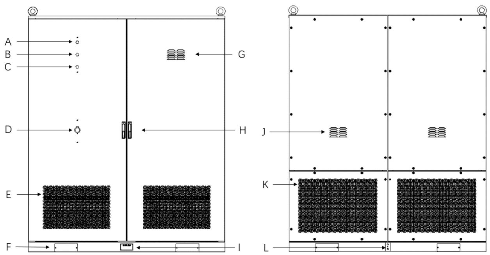  
图 2-1 储能柜外观图

\*以上图片仅供参考，请以收到的实物为准！

表 2-1 储能柜外观说明  

<table><tr><td>储能柜单元</td><td>序号</td><td>主要设备明细</td></tr><tr><td>储能柜</td><td>A</td><td>蜂鸣器</td></tr></table>

<table><tr><td>B</td><td>运行指示灯</td></tr><tr><td>C</td><td>故障指示灯</td></tr><tr><td>D</td><td>急停</td></tr><tr><td>E</td><td>PCS/液冷主机进风口</td></tr><tr><td>F</td><td>叉车孔</td></tr><tr><td>G</td><td>消防排风口</td></tr><tr><td>H</td><td>前门门锁</td></tr><tr><td>1</td><td>铭牌</td></tr><tr><td>J</td><td>消防进风口</td></tr><tr><td>K</td><td>PCS/液冷主机出风口</td></tr><tr><td>L</td><td>柜体接地</td></tr></table>

# LED 指示灯

在储能柜的LCD 触摸屏的上端安装有 2个显示设备主要运行状态的LED 灯，分别为电源指示灯“运行”、故障指示灯“故障”。

表 2-2 LED 显示状态及运行说明  

<table><tr><td>名称</td><td>颜色</td><td>说明</td></tr><tr><td>： RUN</td><td>运行灯点亮</td><td>系统正在运行状态</td></tr><tr><td>● FAULT</td><td>故障灯点亮</td><td>系统故障，并且系统处于停机状态</td></tr></table>

# 蜂鸣器

当储能柜内的复合探测器检测到烟雾、温度、CO任一值达到告警阈值，或者全氟己酮发出喷放信号时，信号传递给消防主机，消防主机启动蜂鸣器报警，表示系统处于危险状态。周围的人员听到报警声后，应立即远离储能柜。

# 2.3 机械参数

储能柜的外观和尺寸如下图 2-2 所示，开门占地位置如下图 2-3 所示。

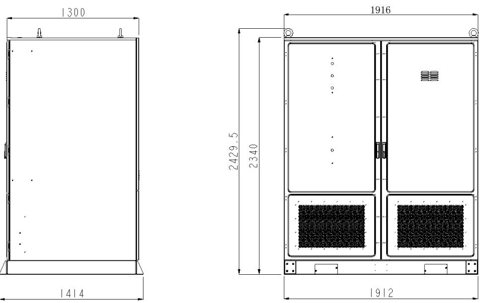  
图 2-2 储能柜尺寸图

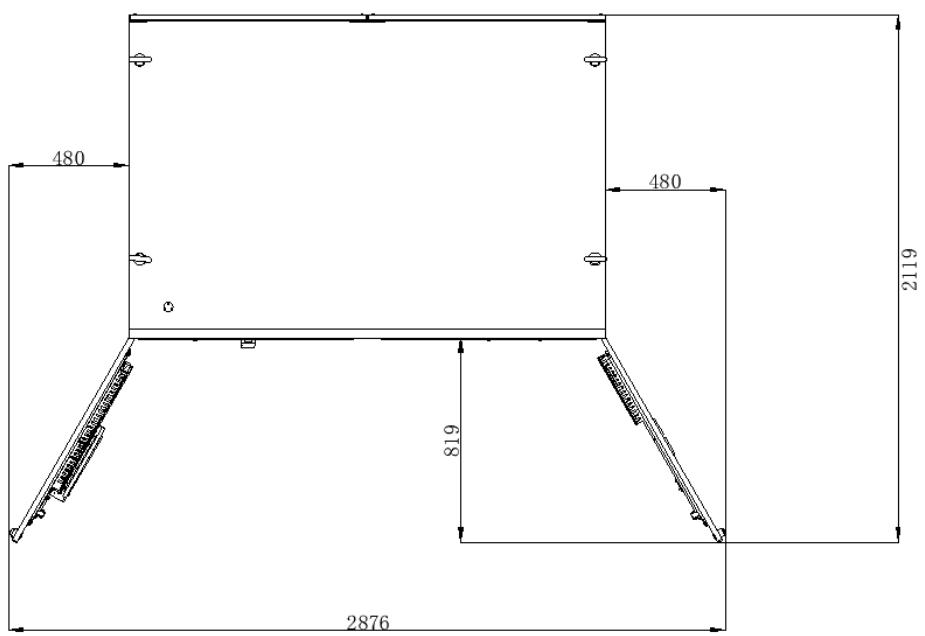  
图 2-3 储能柜开门占地尺寸图

\*以上图片仅供参考，请以收到的实物为准！

# 2.4 内部设计

# 2.4.1 内部设备布局

储能柜的开门前视图如下图 2-4 所示。

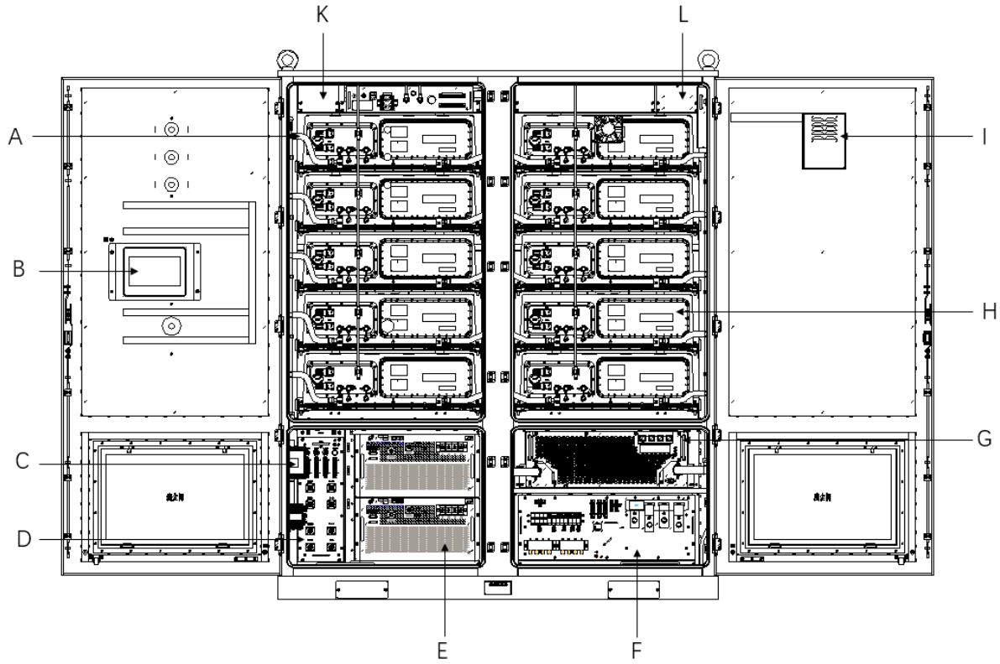  
图 2-4 储能柜内部布局图

\*以上图仅供参考，请以收到的实物为准！

表 2-4 储能柜单元内部设备说明  

<table><tr><td>储能柜单元</td><td>序号</td><td>主要设备明细</td></tr><tr><td></td><td>A</td><td>液冷管路</td></tr><tr><td></td><td>B</td><td>群控（GLC，选配）</td></tr><tr><td></td><td>C</td><td>交换机</td></tr><tr><td></td><td>D</td><td>控制盒</td></tr><tr><td>储能柜</td><td>E</td><td>PCS（两台）</td></tr><tr><td></td><td>F</td><td>配电盒</td></tr><tr><td></td><td>G</td><td>液冷主机</td></tr><tr><td></td><td>H</td><td>电池模组</td></tr><tr><td></td><td>1</td><td>消防排风扇</td></tr><tr><td></td><td>J</td><td>铅酸电池</td></tr><tr><td></td><td>K</td><td>消防集成控制器</td></tr></table>

# 订货说明：

1 当储能柜无 GLC/HMI，且需要用到 4G 功能时，需要选配 4G 路由器及天线。

# 2.4.2 储能变流器

储能变流器（PCS）是连接储能柜和电网的双向电流可控转化装置，主要功能是实现蓄电池与电网之间的能量交换，对蓄电池进行充放电的控制和管理。在并网模式中，可以实现对电网的削峰填谷、调峰调频、虚拟增容以及离网备电；同时，PCS也支持恒压、恒流和浮充的多种充放电模式。

储能柜兼容两款 PCS，下订单时备注清楚。若无备注，默认为恩玖 PCS。

# 2.4.2.1 PCS(恩玖)

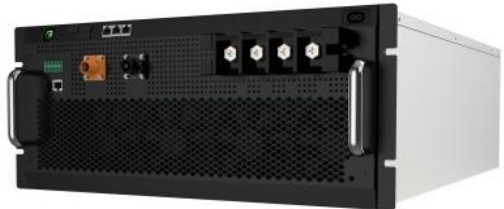  
图 2-5 储能变流器（PCS）

表 2-5 恩玖 PCS 显示状态及运行说明  

<table><tr><td>指示灯</td><td>状态</td><td>说明</td></tr><tr><td rowspan="4">BT</td><td>绿色慢闪</td><td>停机</td></tr><tr><td>绿色快闪</td><td>待机</td></tr><tr><td>绿色常亮</td><td>运行</td></tr><tr><td>红色常亮</td><td>故障</td></tr></table>

注：快闪周期为 1 秒，慢闪周期为 3 秒。

# 2.4.2.2 PCS（盛弘）

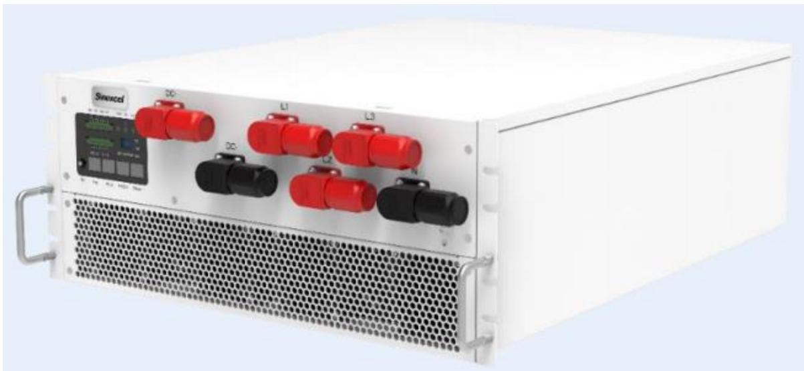  
图 2-6 储能变流器（PCS）

表 2-6 盛弘 PCS 显示状态及运行说明  

<table><tr><td>指示灯</td><td>状态</td><td>说明</td></tr><tr><td rowspan="2">POWER(绿色)</td><td>常亮</td><td>电池及电网均接入</td></tr><tr><td>常灭</td><td>电池及电网均未接入</td></tr><tr><td rowspan="2">RUN(绿色)</td><td>常灭</td><td>PCS 处于启动/停机/故障状态</td></tr><tr><td>常亮</td><td>PCS 处于待机/运行状态</td></tr><tr><td rowspan="2">FAULT(红色)</td><td>闪烁</td><td>告警</td></tr><tr><td>常亮</td><td>故障状态</td></tr></table>

注：闪烁周期为 3 秒。

# 2.4.3 电池簇

以下是磷酸铁锂电芯的典型使用系统架构。以磷酸铁锂电芯为基础，开发标准化、单元化电池模块，电池模块串联并配以控制盒组成电池簇。电池簇接入配套储能变流器（PCS），组成电力储能柜产品（ESS），完成对电能的存储、释放。

目前产品兼容四种电芯，如下表 2-6 和 2-7 提及的参数以宁德 314Ah 来举例，若选用其他厂家电芯，参数值略有出入。

# 电芯

表 2-7 电芯参数  

<table><tr><td>电芯</td><td>参数名称</td><td>参数值</td></tr><tr><td></td><td>尺寸 (深*宽*高）</td><td>71.55mm*174.04mm*207.01mm（±0.8）</td></tr><tr><td></td><td>重量</td><td>5.49±0.3kg</td></tr></table>

<table><tr><td>额定容量</td><td>314Ah</td></tr><tr><td>额定能量</td><td>1004.8Wh</td></tr><tr><td>额定电压</td><td>3.2V</td></tr><tr><td>电压范围</td><td>2.65V-3.65V</td></tr></table>

# 电池模组

表 2-8 电池模组参数  

<table><tr><td>电池模组</td><td>参数名称</td><td>参数值</td></tr><tr><td rowspan="5">新</td><td>倍率</td><td>≤0.5P，推荐0.5P以下</td></tr><tr><td>电芯类型</td><td>方形铝壳 LFP</td></tr><tr><td>组合方式</td><td>1P52S</td></tr><tr><td>关键部件</td><td>52个电芯，1个BMU</td></tr><tr><td>重量</td><td>345kg</td></tr></table>

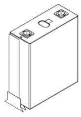  
表 2-9 液冷主机参数

# 控制盒

控制盒包含熔断器、接触器、SAU及电池簇管理单元（BCMU），主要完成对电池簇整体的监控。

# 配电盒

配电盒包含断路器、不间断 UPS电源、交流防雷回路及 24V母线分配单元，主要完成对主回路的保护及辅助回路供电。

# 2.4.4 液冷主机

液冷主机是为储能机柜开发的温度控制产品，集成制冷、制热功能，通过温控管理单元调节温度，为柜内器件提供良好的工作温度环境。

<table><tr><td>液冷主机</td><td>参数名称</td><td>参数值</td></tr><tr><td rowspan="3">V</td><td>额定交流输入电源</td><td>220V±10%/50±1Hz</td></tr><tr><td>制冷量</td><td>6kW</td></tr><tr><td>制热量 供液流量</td><td>4kW</td></tr><tr><td></td><td>外形尺寸(宽*深*高)</td><td>700*900*245mm</td></tr><tr><td></td><td>制冷剂</td><td>R410A</td></tr></table>

# 2.4.5 消防系统

储能柜内安装了消防系统。

消防系统由消防集成装置（内含全氟己酮灭火装置、舱级和PACK 级消防控制阀、消防控制器、舱级消防喷嘴等器件）、PACK 级消防管路及喷嘴、PACK 间连接管、复合型传感器（可探测烟/温/CO）、进排风装置等组成。

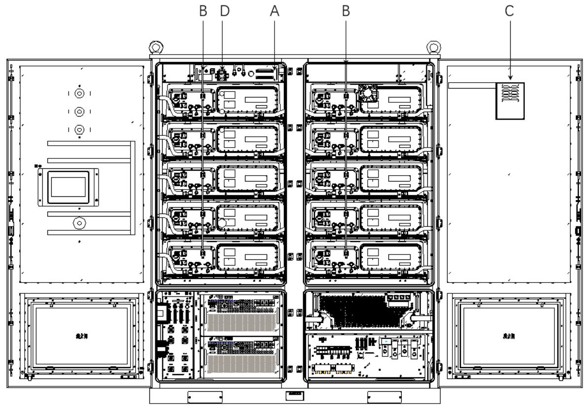  
图 2-6 储能柜消防系统布局图

表 2-8 消防系统布局说明  

<table><tr><td>消防系统单 元</td><td>序号</td><td>主要设备明细</td></tr><tr><td rowspan="5">消防系统</td><td>A</td><td>消防集成装置（内含全氟己酮灭火装置、舱级和PACK级消 防控制阀、消防控制装置、舱级消防喷嘴等器件）</td></tr><tr><td>B</td><td>PACK级消防管路</td></tr><tr><td>C</td><td>排风装置</td></tr><tr><td>D</td><td>复合探测器</td></tr><tr><td></td><td></td></tr></table>

# A 告警

在机械安装的全过程中，必须严格遵守项目所在地的相关标准和要求。

# 3.1 运输条件

储能柜的各种设备在出厂前都已经预安装固定在储能柜内，运输时对储能柜整柜运输即可。

# 告警

⚫ 在装卸、运输的整个过程中，必须遵守项目所在国家/地区的户外柜作业安全规程！

对储能柜的作业中使用的任何机具，均应经过维护。

所有从事装卸和栓固的人员均应接受相应的培训，特别是安全方面的培训。

# 0

# 注意

在装卸、运输的整个过程中，需时刻牢记储能柜的机械参数。

运输移动储能柜需要满足以下条件：

储能柜各柜门紧锁。

根据现场条件，选择合适的叉车或叉运工具。所选工具必须具备足够的承重能力，臂长和旋转半径。

如果需要在斜坡上移动等，可能会需要额外的牵引装置。

清除移动过程中存在或可能存在的一切障碍物，如树木、线缆等。

应尽可能选择在天气条件较好的条件下对储能柜进行运输移动。

⚫ 务必设置警告牌或警示带，避免非工作人员进入叉车运输区域，以免发生意外。

# 3.2 叉车运输

储能柜配有专门用于叉车运输的叉孔。可通过前叉、侧叉移动储能柜。如果使用叉车运输方法，则应满足一下要求：

⚫ 叉车应配备足够的承载能力（至少6t）。  
⚫ 运输储能柜时，插脚的长度至少应为 1400mm。  
$\bullet$ 插脚应插入工作站底部的叉形插孔中（有关叉形插孔的位置，请参见下图）。插入桩号的插脚深度应为桩号的深度，即储能柜至少为 $1 4 0 0 \mathsf { m m }$ 。  
$\bullet$ 储能柜的运输，移动和放下应为缓慢而稳定。建议尝试运输。  
⚫ 只能将储能柜放置在平稳的地方。该地方应排水良好，没有任何障碍或鼓起。

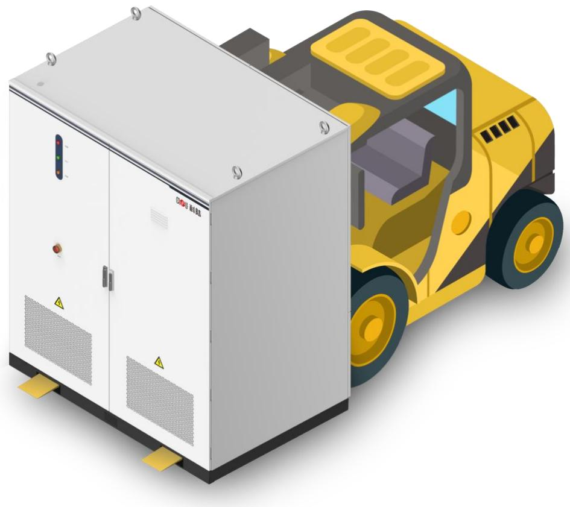  
图 3-1 叉车运输（插装运输示意，柜体外观仅做参考）

# 告警

通过底部前插孔、后插孔、左插孔、右插孔移动储能柜。

在任何情况下，都不能通过将插脚插入叉孔以外的其他位置来移动储能柜。

在对设备进行移动的整个过程中，均需严格按照叉车的安全操作规程进行操作。

移动的机器下方及周围严禁站人，避免发生伤亡事故。

如遇恶劣天气条件，如大雨、大雾、强风等，应停止起吊工作。

# 注意

交付前储能柜插孔是用封板密封起来的。

# 3.3 吊装运输

# 3.3.1 起吊注意事项

在对设备进行起吊时，至少需满足如下要求：

起吊时必须保证现场安全。

在进行吊运安装作业时，现场应有专业人员全程指挥。

所用吊索的强度应能够满足承受设备的重量。

确保所有吊索连接处安全可靠，确保与角件连接的各段吊索等长。

吊索的长度可根据现场实际要求进行适当调整。

$\bullet$ 整个起吊过程中一定要保证设备平稳，不偏斜。

$\bullet$ 采取一切有必要的辅助措施确保设备安全、顺利起吊。

下图给出了设备在起吊过程中的吊车作业示意。图中，内层的虚线圆表示吊车作业范围。在吊车工作时，外层的实线圆内严禁站人！

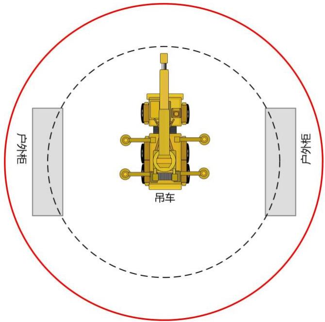  
图 3-2 吊车作业示意图

# 3.3.2 起吊作业

在对设备进行起吊的过程中，各操作环节应按下述要求进行：

⚫ 应垂直起吊设备，起吊时不得出现在地面或下层柜顶上拖曳现象，不应在任何表面上拖推柜体。  
$\bullet$ 设备被吊离支撑面 300mm 后应暂停，对吊具与设备的连接情况进行检查，在确认连接牢固后，方可起吊。  
$\bullet$ 设备到位后应轻放，平稳着落，严禁通过甩动吊具把设备放置在垂直着落外的地方。  
$\bullet$ 设备放置的场地应坚实平坦，排水良好，无障碍物或突出物。

⚫ 可使用带有吊钩或U型钩的吊索对储能柜进行吊顶作业，起吊装置应与储能柜正确连接（吊绳从叉车孔位穿过）。

  
图 3-3 储能柜起吊示意图（吊装运输示意，柜体外观仅做参考）

# 3.4 安装环境要求

# 3.4.1 安装地点选择

在选择安装场地时，请至少遵循下述原则：

⚫ 应充分考虑储能柜安装地的气候环境、地质条件（如应力波发射情况，地下水位）等特点。  
$\bullet$ 周围环境干燥，通风良好，远离易燃易爆区域。  
$\bullet$ 安装现场的土壤需要有一定的紧实度。建议安装场地土壤的相对密实度 $\geq 9 8 \%$ 。若土壤松散，请务必采取措施保证地基稳固。

# 3.4.2 地基选择

# A 告警

储能柜整体较重，在建造地基前应首先对安装场地各项条件（主要指地质条件和环境气候条件等）进行详细考察。只有在此基础上，才可开始地基的设计与建造工作。

不合理的地基建造方案会对储能柜的放置，开关门及后期运行等带来较大困难或麻烦，因此，储能柜的安装地基必须事先按照一定的标准进行设计建造，以满足机械支撑，线缆走线，后期维护检修等的要求。

建造地基时至少应满足下述要求：

⚫ 建造地基的基坑底部务必夯实填平。  
$\bullet$ 地基要足够为储能集成系统提供有效承重支撑，地基用钢筋混泥土制作，混泥土的抗压强度不能低于 C30(储能柜单柜重量约 5t)。  
$\bullet$ 抬高储能集成系统，防止雨水侵蚀储能集成系统底座以及内部。建议地基高出安装现场水平地面约 300mm。  
⚫ 需结合当地地质条件，建造相应的排水措施。  
⚫ 建造足够横截面积和高度的水泥地基。地基高度由施工方根据现场地质来确定。  
$\bullet$ 建造地基时应考虑到线缆布线。  
$\bullet$ 维护平台围绕地基构建，为后期维护带来方便。  
$\bullet$ 根据储能柜上电缆入口和出口的位置和尺寸，在基础施工中，要为交流电缆槽预留足够的空间，并预先其纳入电缆导管。  
$\bullet$ 根据电缆型号和进出线数量确定射孔管的规格和数量。  
$\bullet$ 所有预埋管的两端均暂时密封，以防止杂质进入；否则，后期布线不便。  
$\bullet$ 连接所有电缆后，电缆入口和出口以及接头均用耐火泥或其他合适的材料密封，以防止啮齿动物进入。

# 3.4.3 其他防护措施

# 注意

安装现场应建造有排水系统，避免储能柜底部或柜内设备在雨水充沛季节或大量降水时被水浸泡。

# Midea

# 注意

请勿在安装场地周围近距离范围内种植树木。以防止大风刮倒树枝或刮落树叶堵塞储能柜柜门或进风口。

# 3.5 固定安装

在确认地基建造符合要求，且足够干燥、坚固、平整后，将储能柜叉放至预定位置。储能柜前后各预留2 个（共 4个）腰孔，使用M12 膨胀螺栓，将储能柜固定在地基上。

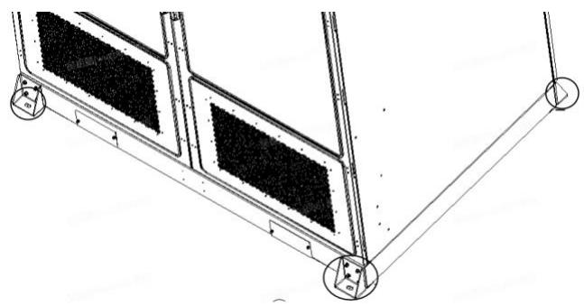  
图 3-4 储能柜固定

推荐安装空间

储能柜可多面并柜安装，其左侧、右侧与相邻储能柜之间可以选择无需预留距离，也可适当预留一定空间（ $5 0 \mathsf { m m }$ ）。

机柜前方需预留 $2 5 0 0 \mathsf { m m }$ （其中 $1 1 0 0 \mathsf { m m }$ 方便开门进行安装、维护、布线等操作；但是考虑电池包/非电池包的维护工装，前方至少预留 2500mm）。

柜体后侧建议预留不少于 600mm 的操作空间，方便机柜的固定和后期的维护。

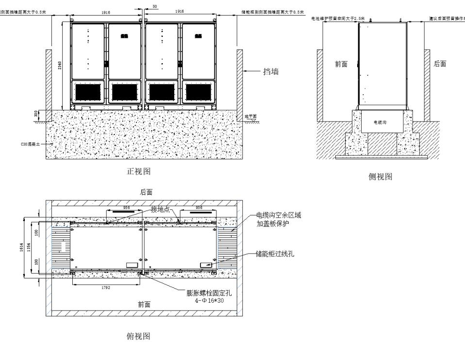  
图 3-5 储能柜并机安装示意图（2 台储能柜并柜举例）

# 4.1 安全注意事项

# 4.1.1 总则

# 危险

高压危险！电击危险！

严禁触摸带电部分！

安装前请确保交直流侧均不带电。

请勿将储能集成系统置于易燃物表面。

# 危险

当储能柜发生接地故障时，原本不带电的部分可能会存在致命高电压。若意外触碰，非常危险！操作前，请先确保系统没有接地故障发生，同时，也需做好相关的防护措施。

# 告警

1) 所有的电气连接必须符合项目所在国家/地区的相关标准和规范。

2) 仅当得到本地供电公司许可并由专业的技术人员安装完成后方可将储能集成系统与电网侧相连接。

# A 告警

只有专业的电工或者具备专业资格的人员才能对本产品进行电气连接。请严格按照设备内部的接线标识执行接线操作。接线前，需断开储能集成系统交直流侧。

# A 告警

接线前，需断开储能集成系统交直流侧。

# Midea

# 告警

风沙及湿气的进入，可能会损坏储能柜内的电气设备，或影响设备运行性能！

风沙季节，或当周围环境中相对湿度大于 $9 5 \%$ 时，应避免电气连接工作。

在无风沙，且天气晴朗干燥时，再开始各项连接工作。

# 告警

如不遵守力矩要求可能会导致连接处起火！

在电气连接过程中，必须严格按照本手册中所描述的力矩对螺栓进行紧固。

# 告警

只有具备资质的电气工程师才能进行电气连接相关的工作。请遵守本手册1 安全注意事项给出的各项要求。由于忽视这些安全须知而导致的人员伤亡或财产损失，本公司概不承担任何责任。

# A 告警

在进行线缆敷设时，要保证电气绝缘并遵守 EMC规范，功率电缆与电源及通讯线缆应分层敷设。并在必要时，为线缆提供保护及支撑，以减少电缆承受的应力。

# 告警

请严格按照设备内部的接线标识执行接线操作。

# 注意

储能集成系统的安装设计必须符合项目所在国家/地区的相关标准或规范。

⚫ 如果没有按照本手册给出的安装设计要求，或未遵照安装所在地相关电气标准或规范进行安装，而引起储能柜或系统故障，将不在质保范围内。

# 4.1.2 五大安全法则

在进行电气连接的整个过程中，以及其他所有对储能集成系统等设备施行的操作，均需遵守下述的五大安全法则：

$\bullet$ 断开储能集成系统的所有外部连接，以及与设备内部供电电源的连接。  
$\bullet$ 确保各断开处不会被意外重新上电。  
$\bullet$ 使用万用表确保设备内部已完全不带电。  
⚫ 施行必要的接地。  
⚫ 对操作部分的临近可能带电部件，使用绝缘材质的布料进行绝缘遮盖。

# 4.2 接线总览

储能柜接线图如下所示：

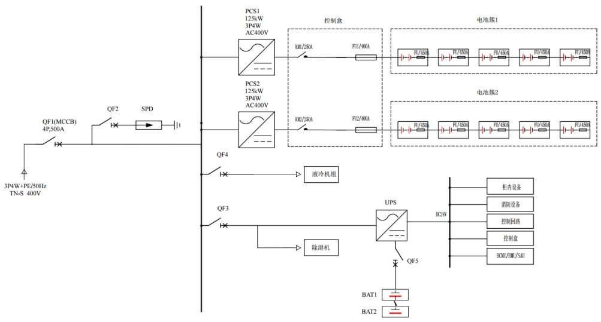  
图 4-1 储能柜接线图

储能柜对外接线简易，主要有四类线缆，如下表 4-1 所示，具体每一处的接线，详见第“4.5-4.9”章节。

表 4-1 接口说明  

<table><tr><td>序号 描述</td><td>推荐规格</td><td></td></tr><tr><td>1</td><td>交流输出端口</td><td>1* （3*240 mm² +2*120mm²） /400V/#Cu</td></tr><tr><td>2</td><td>接地点</td><td>120 mm²或接地扁钢</td></tr><tr><td>3</td><td>交换机接口</td><td>CAT-5以太网线</td></tr><tr><td>4</td><td>电表/外设 RS485 接口</td><td>RVVSP 2*0.5</td></tr></table>

注：此表中连接的线缆都是按单储能柜配置，不在供货范围内。

# Midea

# 告警

所有的电气连接，均需严格按照接线原理图进行。

所有的电气连接，都必须在设备完全不带电的情况下进行。

# 告警

只有具备资质的电气工程师才能进行电气连接相关的工作。请遵守本手册 “安全须知”给出的各项要求。由于忽视这些安全须知而导致的人员伤亡或财产损失，本公司不承担任何责任。

#

# 注意

储能柜的安装设计必须符合项目所在国家/地区的相关标准或规范。

⚫ 如果没有按照本手册给出的安装设计要求进行安装，而引起储能柜和汇流柜或系统故障，将不在质保范围内。

# 4.3 接线零部件

# ！ 告警

储能柜交流侧不正确的接线顺序可能导致起火燃烧。请注意接线部件的连接顺序。

连接时，确保连接件的紧固。若连接不充分或接触面氧化亦会引起热量过大，可能导致火灾。

#

# 注意

⚫ 选择接线铜鼻子宽度和长度应适当，，太宽会安装不进穿墙端子或影响设备相间的绝缘性能，甚至造成短路。

⚫ 安装完成后，需检查接线铜鼻子与穿墙端子的搭接处，是否有部分热缩套管被夹，如被夹应及时去除，否则可能会导致接触不良，甚至损坏设备。

储能柜功率电缆接线使用的固定螺钉等零件，设备交付时已经安装在相应端子上。请严格遵照本节的描述对线缆进行连接。

# 4.3.1 铜线接入

若选择铜线缆，则接线零部件的连接顺序如下图所示。

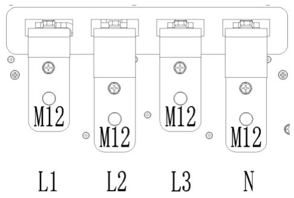  
图 4-2 铜端子连接顺序

<table><tr><td>编号</td><td>名称</td><td>规格</td><td>备注</td></tr><tr><td>1</td><td>螺栓</td><td>4-M12*30</td><td>自带</td></tr></table>

# 4.4 电气接线准备

# 4.4.1 安装工具

安装前需要至少准备如下的工具及零件：

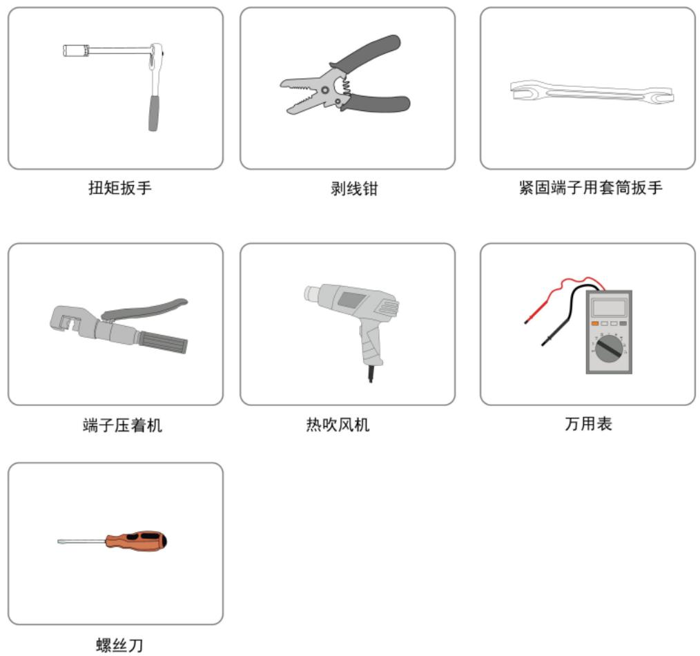

# 4.4.2 制作接线端子

按照下面所示步骤，制作接线端子。

步骤 1 剥掉电缆的绝缘皮，电缆末端的绝缘皮剥掉的长度应为接线铜鼻压线孔的深度另加5mm 左右。

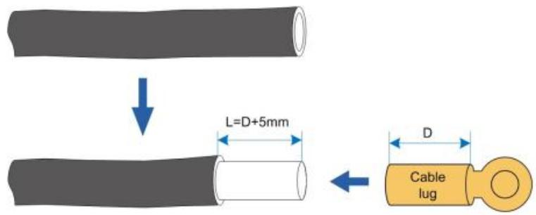

步骤 2 压接接线铜鼻。

1 将剥好的线头裸露的铜芯部分放到接线铜鼻的压线孔内。

2 使用端子压着机将接线铜鼻压紧。压接数量应在两道以上。

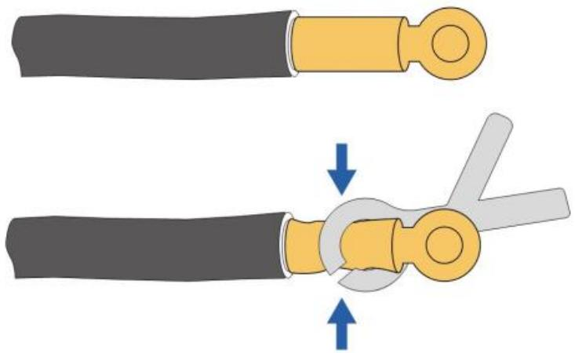

步骤 3 安装热缩套管。

1 选择与线缆尺寸较符合的热缩套管，长度应超出接线铜鼻压线管约 2cm。

2 将热缩套管套在接线铜鼻上，以完全覆盖接线铜鼻的压线孔为适。

3 用热吹风机是热缩套管缩紧。

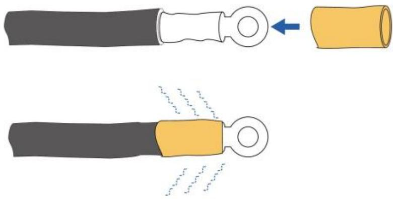

—结束

# 4.4.3 打开柜门

在电缆连接之前打开门。

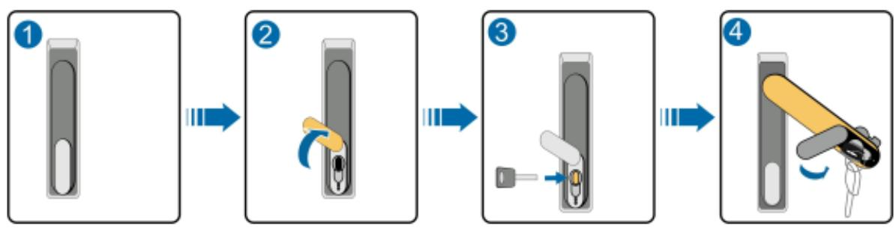  
图 4-3 开前门步骤

<table><tr><td>步骤 说明</td><td></td></tr><tr><td>1</td><td>锁定状态</td></tr><tr><td>2</td><td>将盖向上移到锁定孔上方</td></tr><tr><td>3</td><td>插入门钥匙并顺时针旋转</td></tr><tr><td>4</td><td>逆时针旋转手柄至图中所示的位置以打开前门</td></tr></table>

# 4.4.4 检查线缆

# 告警

在电气连接之前，检查以确保所有线缆的完整性和绝缘性。若存在破损的线缆，请及时更换。 绝缘不良或电缆损坏可能会造成危险。

储能柜内部设备间的接线工作已在出厂前全部完成。用户需要：

检查连接线缆是否存在损伤，如果发现，请立即更换相同规格型号线缆。

检查线缆连接处是否已紧固到位。确保所有接线端子均已紧固。

# 4.4.5 接线时注意事项

# A 告警

接线前，必须检查所有输入线缆的极性，确保每路输入极性均正确。

在电气安装过程中，切勿用力拉扯线缆或导线，以免损坏其绝缘性能。

所有线缆和导线均应保证有一定的弯曲空间。

# Midea

采取必要的辅助措施，减少线缆或导线承受的应力。

每一步接线操作结束后，均需仔细检查，确保接线正确、牢固。

# 4.5 接地连接

# 4.5.1 简介

# 告警

接地连接必须符合项目所在国家/地区的接地标准及规范。

# 告警

接地线必须良好接地！除此以外：

故障发生时可能导致致命的电击！

闪电可能会损坏设备！

设备可能无法正常运行！

#

# 注意

在接地期间，请注意：

⚫ 设备和接地电极之间的接地连接必须可靠地固定。  
⚫ 接地后测量接地电阻，接地电阻应不大于 $0 . 1 \Omega$ 。

# 4.5.2 内部设备等电位连接

出厂前，储能柜内部主要电气设备至接地端子的接线均已完成。需执行下述操作：

通过测量各设备接地端至总接地铜排的导电性，来确保各内部接地连接的有效性。

储能柜对外连接各线缆的屏蔽层，保护层等，也应在储能柜选择合适地点接地。

# 4.5.3 外部接地

# ！ 告警

严格按照设备内部的接线标识进行电缆连接。

储能柜包括内部接地和外部接地。

交付之前，储能柜内部设备的接地已完成。

接地：

推荐使用接地扁钢或 $\scriptstyle 1 2 0 { \mathsf { m m } } ^ { 2 }$ 的铜接地线缆，将接地点与柜体接地点可靠连接。

若使用线缆，推荐使用压接 SC120-10或 DT120-10接线端子，具体步骤请参考“4.4”准备线缆；使用${ \sf M } 1 0 \times 2 5$ 螺栓，将 SC/DT 端子固定至接线孔，紧固扭矩 $4 0 \ : \mathsf { N } \cdot \mathsf { m }$ 。

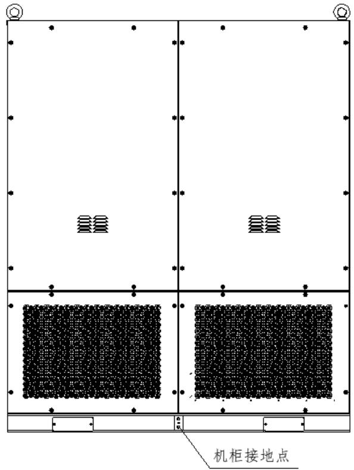  
图 4-4 储能柜接地示意图

请结合现场实际情况，并遵照电站工作人员的指示对外部接地进行安装。

接地连接结束后须测量接地电阻。

# 4.6 交流接线

# 4.6.1 安全注意事项

# 告警

意外触碰带电端子会导致致命电击危险！

确保储能变流器交直流开关处于断开状态，确保接线端子不带电。

与电网进行连接时，必须经相关部门允许，同时遵守所有与电网相关的安全指令规范。

# ！ 告警

连接交流电网时，断开上流交流侧断路器，确保触点端子无电压。

只有在获得公用电网批准并遵循所有相关安全说明，才能连接到电网。

交流输出未在设备内部接地。

⚫ 直流和交流电路与外壳隔离，如果相关国家电气规范有要求，则需要安装人员进行系统接连接。

# 4.6.2 交流输出接线步骤

步骤 1 断开上游交流断路器并用万用表测量以确保端子无电压。

步骤 2 将电缆分别从储能柜底部进线孔引入柜内，进入配电盒接线区域。

步骤 3 确保交流电缆连接顺序正确。

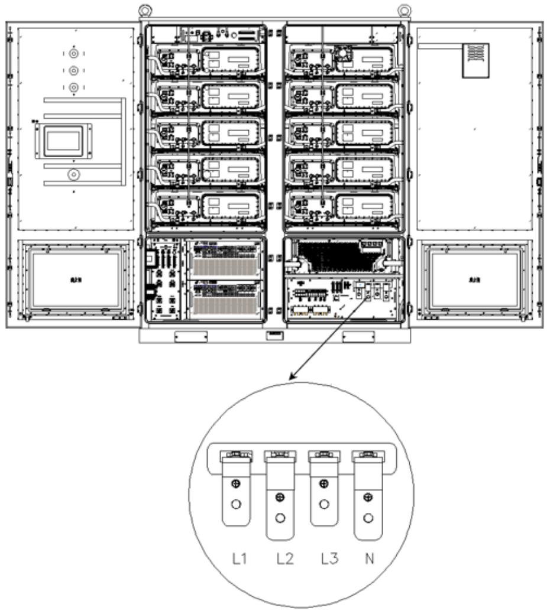  
图 4-6 交流输出接线位置图

步骤 4 使用剥线钳剥去线缆防护层，露出铜芯部分。

步骤 5 使用 SC/DT 端子压接，参考“4.4.2 准备线缆”。推荐铜线缆截面不小于 $2 4 0 \mathsf { m } \mathsf { m } ^ { 2 }$ 。

步骤 6 使用M12 螺栓，将 SC/DT 端子固定至接线孔，紧固扭矩为 $7 5 \ : \mathsf { N } \cdot \mathsf { m }$ 。（详细操作， 可参考4.3.1“铜线接入”。）

步骤 7 接线完成后，轻拽线缆，确保留有裕量。

# 4.7 交换机接口

当多台储能柜并机使用的情况下，交换机用于连接至各从机，

接线说明：

网线电缆分别从储能柜底部进线孔引入柜内，进入交换机接线区域。

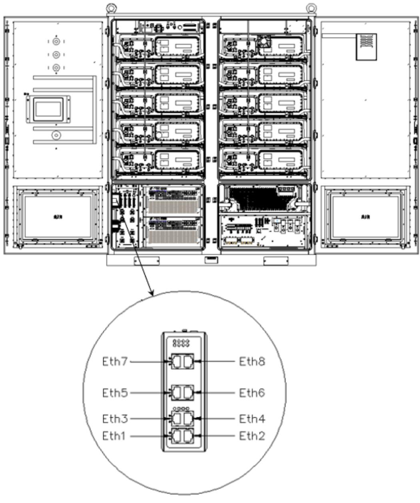  
图 4-7 交换机接线位置图（交换机接口仅供参考，以实物为准）

表 4-3 主机接口说明  
表 4-4 从机接口说明  

<table><tr><td>接口名称</td><td>说明</td></tr><tr><td>1#</td><td>GLC/EMS工控机/EMS柜（选 配）</td></tr><tr><td>2#</td><td>本柜LC</td></tr><tr><td>3#</td><td>接从机交换机的4#口</td></tr><tr><td>4#</td><td>4G（选配）</td></tr></table>

<table><tr><td>接口名称</td><td>说明</td></tr><tr><td>1#</td><td>预留</td></tr><tr><td>2#</td><td>本柜LC</td></tr><tr><td>3#</td><td>接下一个从机交换机 4#□</td></tr><tr><td>4#</td><td>主机/上一个从机交换机3#□</td></tr></table>

多台交换机级联接线示意图：

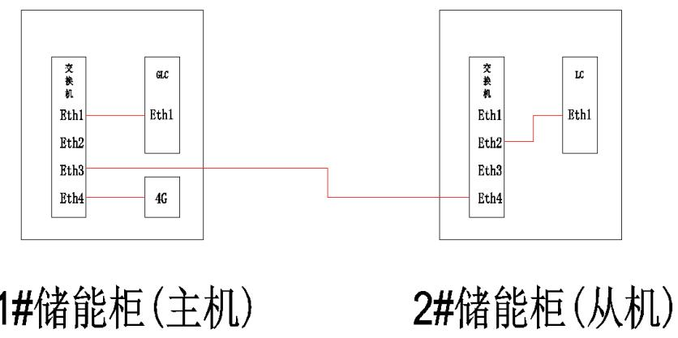  
图 4-8 交换机接线示意图

# 4.8 GLC 接口（选配）

当作为主机使用，或客户需要外接多块电表时，需要安装 GLC/EMS；GLC/EMS 与外部电表的连接线缆从储能柜底部进线孔引入柜内，接入到 GLC/EMS 引出预留的接线端子；

电表注意事项：为了保障网络畅通、延迟低、信号衰减小，电表接线推荐使用屏蔽双绞线；线缆长度宜 $\leqslant 3 0 0 \mathsf { m }$ 。首推 DT/L 645 协议（若使用 Modbus RTU 协议，请与我司提前沟通）

表 4-2为RS485 接口示意，具体项目会根据实际情况单独出具对外接线图，指导现场接线；策略表优先接在 COM5 与 COM4。

表 4-2 GLC 接口说明  

<table><tr><td>串行通讯接口名称</td><td>说明</td><td>电表</td></tr><tr><td>COM5</td><td>RS485</td><td>低压策略表1</td></tr><tr><td>COM4</td><td>RS485</td><td>高压策略表</td></tr><tr><td>COM3</td><td>RS485</td><td>低压策略表2</td></tr><tr><td>COM2</td><td>RS485</td><td>计量电表1</td></tr><tr><td>COM1</td><td>RS485</td><td>计量电表2</td></tr></table>

# 4.9 EMS 接口（选配）

当作为主机使用，或客户需要外接多块电表时，需要安装 GLC/EMS；GLC/EMS 与外部电表的连接线缆从储能柜底部进线孔引入柜内，接入到 GLC/EMS 引出预留的接线端子；

电表注意事项：为了保障网络畅通、延迟低、信号衰减小，电表接线推荐使用屏蔽双绞线；线缆长度宜 $\leqslant 3 0 0 \mathsf { m }$ 。首推 DT/L 645 协议（若使用 Modbus RTU 协议，请与我司提前沟通）

表 4-3为RS485 接口示意，具体项目会根据实际情况单独出具对外接线图，指导现场接线；根据接口顺序接入。

表 4-3 EMS 接口说明  

<table><tr><td>串行通讯接口名称</td><td>说明</td><td>电表</td></tr><tr><td>COM1</td><td>RS485</td><td>高压策略表</td></tr><tr><td>COM2</td><td>RS485</td><td>低压策略表</td></tr><tr><td>COM3</td><td>RS485</td><td>计量表</td></tr><tr><td>COM4</td><td>RS485</td><td>低压策略表</td></tr><tr><td>COM5</td><td>RS485</td><td>计量表</td></tr><tr><td>COM6</td><td>RS485</td><td>低压策略表</td></tr><tr><td>COM7</td><td>RS485</td><td>计量表</td></tr></table>

# 4.10 接线后操作

在所有电气连接完成后，应对接线进行全面仔细的检查。同时，也需要进行以下操作：

$\bullet$ 检查所有进出风口无异物遮挡或堵塞。  
$\bullet$ 对户外柜进出线孔及四周的缝隙，使用防火、防水材料进行严密封堵。

# A 告警

如不能正确密封，可能导致湿气进入设备。

如不能正确密封，可能导致啮齿类动物进入。

锁紧柜门

步骤 1 按照与拆除方法相反的步骤(参考“打开柜门”)，将安装接线区域防护罩重新安装。

步骤 2 锁上柜门，拔出钥匙。

#

# 注意

柜门关闭后需确认柜门四周的密封条不能卷曲！

# 5.1 上电操作

# 5.1.1 上电前检查

上电前，请仔细核对以下项目，确保无误。

检查接线是否正确。

设备内部的防护罩已安装牢固。

紧急停机按钮处于松开状态。

检查以确保无接地故障。

使用万用表检测交、直流侧电压是否满足启动条件，且无过压危险。

检查以确保没有工具或零件遗落在设备内部。

检查所有进出风口无异物遮挡或堵塞。

# 5.1.2 上电步骤

在上电前，必须对设备进行全面细致的检查，保证各项指标均符合要求后，才可上电。

已完成户外柜的功率及通讯接线。

请确保户外温度为- $3 0 - 5 5 ^ { \circ } \mathrm { C }$ 。

# 注意

不建议在低于- $\cdot 3 0 ^ { \circ } \mathrm { C }$ 的温度下进行上电操作。如温度过低，系统加热电芯时间会持续 24 小时及以上，在此时间内，系统无法正常运行。

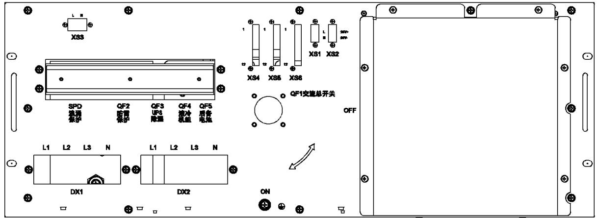  
图 5-1 操作开关位置图（开前门）

步骤 1 按第4 章完成所有接线，测量电压及频率满足系统要求，进行下一步操作；

步骤 2 检查柜门上急停开关是否处于正常状态，若处于正常状态，进行以下步骤，若不是正常状态，进行复位后，在进行以下步骤；

步骤 3 闭合配电盒正面板的 QF1（交流总开关），系统交流侧上电完成；

步骤 4 闭合配电盒正面板的 QF2（SPD 开关），SPD 上电完成；

步骤 5 闭合配电盒正面板的 QF4（液冷主机开关），液冷机组上电完成；

步骤 6 闭合配电盒正面板的 QF3（UPS 开关、除湿机开关），储能柜 UPS 电源上电完成。此时柜内所有 24Vdc 辅助供电总回路得电，储能柜柜门电源指示灯亮；

步骤 7 闭合配电盒正面板的 QF5（UPS 电池回路开关），UPS 电池上电完成；

结束

自此，系统上电完成，可以检查操作触摸屏，检查系统是否正常。具体触摸屏操作请详细阅读《GLC/EMS/云平台操作手册》。

# 5.2 下电操作

各断路器的位置，请参照上一页图 5-1。

步骤 1 首先，控制触摸屏界面让系统停机，再操作开关断电；具体触摸屏操作请详细阅读《GLC/EMS/云平台操作手册》。

步骤 2 断开储能柜柜内系统控制供电，断开 QF5（UPS 电池回路开关），储能柜 24V 设备下电完成；

注意：不使用时，UPS 与电池连接必须断开 QF5（UPS 电池回路开关）；

步骤 3 断开配电盒正面板的 QF3（UPS 开关、除湿机开关），UPS 下电完成，除湿机组下电完成；

步骤 4 断开配电盒正面板的 QF4（液冷主机开关），液冷机组下电完成；

步骤 5 断开配电盒正面板的 QF2（SPD 开关），SPD 下电完成；

步骤 6 断开配电盒正面板的 QF1（交流总开关），系统交流侧下电完成；

—结束自此，系统下电完成。

本地控制器 LC 详见《LC 用户手册》介绍；  
群控器 GLC 详见《GLC 用户手册》。

本章节供了以下信息：

$\bullet$ 维护和修理流程必须按照一定的规则实施，以确保配件的可用性

$\bullet$ 当设备维修时，如何更换元器件

$\bullet$ 我司不承担因个人不当意图或未正确遵循本文指示和警告信息进行拆卸，安装，维护等操作造成的人身伤害和财产损失的责任。

安装和维护系统时必须遵循警告信息。

# A 告警

在安装系统之前阅读整个文档。违反安全操作规范或不遵循本文件中的操作指示或警告信息都可能导致电击、重伤或死亡，可能损坏系统，导致其无法操作。

储能柜及电池模块有一定重量。移动或升降建议使用专业设备。

请本文指示安装和维护系统。

如果有设备有缺陷、出现裂纹、断裂或其他损坏，禁止操作。

在行电气接线部分之前，确保断路器处于断开状态。

不要将异物插入机柜的任何部分。

不要将机柜或其部件暴露于直接火焰中。

不要将机柜或其部件暴露于直接火焰中。

不要在加热设备附近安装机柜。

不要将机柜或其部件浸入水中或其他液体中

# 注意

⚫ 储能柜上不要倚靠任何东西及堆叠任何东西，也不要把任何东西挂在电池组上或通向电池组管道的电线上。

不要使用本手册规定以外的配件或线缆组装系统。

确保电池组上方或附近没有水源，包括消防喷头或水龙头、空调滴水等。

# 注意

在实施维护或者修理工作时首先测量电压。这个电压可以在交流断路器的铜排上测量。

# 7.1 维护前注意事项

对储能柜进行维护或检修等操作时，为确保操作人员的安全，在系统维护之前必须在系统停机并且不带电的情况下进行，并按以下步骤进行操作：

1、控制储能变流器脱网停机。

2、确保储能变流器不会被意外重新上电。

3、断开储能柜所有外部连接。

4、断开储能柜内部供电电源的连接，手动关闭 UPS（如有）。

5、检测系统内开关是否已断开。

6、施行必要的接地连接。

# 7.2 维护项目及周期

由于环境温度、湿度、灰尘、振动以及长期使用等影响，储能柜内部的器件会发生老化及磨损等，从而导致储能柜潜在的故障发生。因此，有必要对储能柜实施日常及定期维护，以保证其正常运转与使用寿命。一切有助于储能柜处于良好工作状态的措施及方法，均属于维护工作的范畴。

维护的目的是保护电柜的特定环境。必须按照特定的周期移除尘土和污染物并且替换局部损坏的部件。

常见的维护项目及周期见表 7-1 所示。

表 7-1 系统维护项目及周期  

<table><tr><td colspan="1" rowspan="1">序号</td><td colspan="1" rowspan="1">检查内容</td><td colspan="1" rowspan="1">周期</td></tr><tr><td colspan="1" rowspan="1">1</td><td colspan="1" rowspan="1">系统软件及运行状态检查</td><td colspan="1" rowspan="1">每6个月</td></tr><tr><td colspan="1" rowspan="1">2</td><td colspan="1" rowspan="1">整机机柜及环境检查</td><td colspan="1" rowspan="1">每6个月</td></tr><tr><td colspan="1" rowspan="1">3</td><td colspan="1" rowspan="1">液冷主机维护检查</td><td colspan="1" rowspan="1">每6个月</td></tr><tr><td colspan="1" rowspan="1">4</td><td colspan="1" rowspan="1">消防系统全面检查</td><td colspan="1" rowspan="1">每12个月</td></tr><tr><td colspan="1" rowspan="1">5</td><td colspan="1" rowspan="1">功率回路及回路主开关检查</td><td colspan="1" rowspan="1">每12个月</td></tr><tr><td colspan="1" rowspan="1">6</td><td colspan="1" rowspan="1">UPS检查</td><td colspan="1" rowspan="1">每12个月</td></tr><tr><td colspan="1" rowspan="1">7</td><td colspan="1" rowspan="1">信号电路检查</td><td colspan="1" rowspan="1">每12个月</td></tr><tr><td colspan="1" rowspan="1">8</td><td colspan="1" rowspan="1">系统清洁</td><td colspan="1" rowspan="1">每12个月</td></tr><tr><td colspan="1" rowspan="1">9</td><td colspan="1" rowspan="1">安全功能检查</td><td colspan="1" rowspan="1">每12个月</td></tr><tr><td colspan="1" rowspan="1">10</td><td colspan="1" rowspan="1">接地可靠性检查</td><td colspan="1" rowspan="1">每12个月</td></tr><tr><td colspan="1" rowspan="1">11</td><td colspan="1" rowspan="1">标签脱落</td><td colspan="1" rowspan="1">每发现标签脱落时</td></tr></table>

注意：维修次序的实际间隔应该依赖于电柜安装环境以及操作状况。

# 7.3 系统软件及运行状态检查

1 读取软件中的数据，检查各项设置参数。

2 若有需要进行软件升级。

# 7.4 整机机柜及环境检查

1 柜门胶条老化，柜门紧闭性。

2 柜体外观油漆是否破损，外表面及螺丝是否生锈。

3 柜体接地是否有效。

4 防尘网的尘垢。

# 7.5 液冷主机维护检查

1 液冷主机根据当地正常气候设置参数后，每 6个月检查维护一次。如果气候出现极端或异常，可在液冷主机维护时根据当地实际气候做适当调整。

2 液冷主机进出风过滤网应根据工作环境定期清理，通常情况下每 6 个月检查清洁一次，如果周边环境沙尘，油污、纤维、柳絮等比较多，应该缩短液冷主机过滤网清理时间。

3 冷却液泄露检查

a) 检查电池包进出水口处、液冷管路连接处、顶部排气阀接头处、液冷机进出水口处等位置。

b) 根据泄漏位置及时联系本公司服务工程师进行器件更换和补液处理。

# 7.6 消防系统全面检查（部分产品不涉及）

# 7.6.1 周期性检查维护

<table><tr><td>维护周期 维护内容</td><td>月度维护</td><td>季度维护</td><td>年度维护</td></tr><tr><td rowspan="3">维护内容</td><td>1．检查内容</td><td>1．检查内容</td><td>1．检查内容</td></tr><tr><td>★瓶组压力检测</td><td>★瓶组压力检测</td><td>★瓶组压力检测</td></tr><tr><td>要求： 瓶组压力，灭火剂瓶组</td><td>要求： 瓶组压力，触摸屏上压</td><td>要求： 瓶组压力，触摸屏上</td></tr><tr><td>区范围内（1.8MPa～ 3. 2MPa)</td><td>求范围内1.8MPa～ 3.2MPa;</td><td>求范围内1.8MPa～ 3. 2MPa;</td></tr><tr><td>异常措施：</td><td>异常措施：</td><td>异常措施：</td></tr><tr><td>①低于1.8MPa，联系厂 家进行瓶组补充氮气或 者灭火剂；</td><td>①低于1.8MPa，联系厂 家进行瓶组补充氮气或 者灭火剂；</td><td>①低于1.8MPa，联系厂 家进行瓶组补充氮气或者 灭火剂；</td></tr><tr><td>②高于3.2MPa，联系厂 家或在厂家远程指导下</td><td>②高于3.2MPa，联系厂 家或在厂家远程指导下</td><td>②高于3.2MPa，联系厂 家或在厂家远程指导下进</td></tr><tr><td>进行放气处理；</td><td>进行放气处理；</td><td>行放气处理；</td></tr><tr><td>2．检查投入内容</td><td>2．检查内容</td><td>2.检查内容</td></tr><tr><td>排烟风机检查（目测）</td><td>排烟风机检查（目测）</td><td>排烟风机检查（目测）</td></tr><tr><td>要求：</td><td></td><td></td></tr><tr><td></td><td>要求：</td><td>要求：</td></tr><tr><td>部件外表面无变形现</td><td>部件外表面无变形现</td><td>部件外表面无变形现象，</td></tr><tr><td>象，未启动条件下，扇</td><td>象，未启动条件下，扇</td><td>未启动条件下，扇叶处应</td></tr><tr><td>叶处应无异物；</td><td>叶处应无异物；</td><td>无异物；</td></tr><tr><td>异常措施：</td><td>异常措施：</td><td>异常措施：</td></tr><tr><td>存在变形：部件目测有</td><td>存在变形：部件目测有</td><td>存在变形：部件目测有宏</td></tr><tr><td>宏观变形，非人为破坏</td><td>宏观变形，非人为破坏</td><td>观变形，非人为破坏时，</td></tr><tr><td>时，应联系厂家或在厂</td><td>时，应联系厂家或在厂</td><td>应联系厂家或在厂家指导</td></tr><tr><td>家指导下进行修复处矫</td><td>家指导下进行修复处矫</td><td>下进行修复处矫正，如无</td></tr><tr><td>正，如无法修复的，应</td><td>正，如无法修复的，应</td><td>法修复的，应在有备品的</td></tr><tr><td>在有备品的情况下将原</td><td>在有备品的情况下将原</td><td>情况下将原部件拆除并返</td></tr><tr><td>部件拆除并返厂进行维</td><td>部件拆除并返厂进行维</td><td>厂进行维修或更换。</td></tr><tr><td>修或更换。</td><td>修或更换。</td><td></td></tr><tr><td>3．检查内容</td><td></td><td></td></tr><tr><td>接线端子排检查(目测)</td><td>3．检查内容 接线端子排检查(目测)</td><td>3．检查内容</td></tr><tr><td>要求：</td><td></td><td>接线端子排检查（目测）</td></tr><tr><td></td><td>要求：</td><td>要求：</td></tr><tr><td>端子排无脱落，端子材 料无断裂；</td><td>端子排无脱落，端子材 料无断裂；</td><td>端子排无脱落，端子材料 无断裂；</td></tr><tr><td>异常措施：</td><td></td><td></td></tr><tr><td></td><td>异常措施：</td><td>异常措施：</td></tr><tr><td>脱落：重新安装端子</td><td>脱落：重新安装端子</td><td>脱落：重新安装端子排，</td></tr><tr><td>排，并锁紧两侧边螺</td><td>排，并锁紧两侧边螺</td><td>并锁紧两侧边螺丝。如过</td></tr><tr><td>丝。如过存在螺丝损坏</td><td>丝。如过存在螺丝损坏</td><td>存在螺丝损坏无法锁紧</td></tr><tr><td></td><td></td><td></td></tr><tr><td>无法锁紧的，应在有备</td><td>无法锁紧的，应在有备</td><td>的，应在有备品的情况</td></tr><tr><td>品的情况下，联系厂家 进行机箱拆除更换端子 母座操作；</td><td>品的情况下，联系厂家 进行机箱拆除更换端子 母座操作；</td><td>下，联系厂家进行机箱拆 除更换端子母座操作； 断裂：在有备品的情况下 进行端子更换。</td></tr><tr><td>断裂：在有备品的情况 下进行端子更换。 4.检查内容： 消防机箱外观检查</td><td>断裂：在有备品的情况 下进行端子更换。 4.检查内容： 消防机箱外观检查，固</td><td>4．检查内容： 消防机箱外观检查，固定</td></tr><tr><td>要求： 机箱外表面应无腐蚀、 变形；</td><td>定情况检查 要求： 机箱外表面应无腐蚀、 变形； 机箱固定螺丝无松动、</td><td>情况检查 要求： 机箱外表面应无腐蚀、变 形； 机箱固定螺丝无松动、掉</td></tr><tr><td>异常措施： 腐蚀：机箱出现腐蚀面 积超过1/3并出现腐蚀 的，联系厂家进行部件 更换；腐蚀面积小于 1/3的，联系厂家或在 厂家指导下进行外表修 补； 变形：机箱目测有宏观 变形，应联系厂家或在 厂家指导下进行修复处 矫正，如无法修复的， 应在有备品的情况下将 原系统拆除并返厂进行</td><td>掉落 异常措施： 腐蚀：机箱出现腐蚀面 积超过1/3并出现腐蚀 的，联系厂家进行部件 更换；腐蚀面积小于 1/3的，联系厂家或在 厂家指导下进行外表修 补； 变形：机箱目测有宏观 变形，应联系厂家或在 厂家指导下进行修复处 矫正，如无法修复的， 应在有备品的情况下将 并返厂进行维修或更换。 原系统拆除并返厂进行 固定螺丝松动脱落：重新</td><td>落 异常措施： 腐蚀：机箱出现腐蚀面积 超过1/3并出现腐蚀的, 联系厂家进行部件更换； 腐蚀面积小于1/3的，联 系厂家或在厂家指导下进 行外表修补； 变形：机箱目测有宏观变 形，应联系厂家或在厂家 指导下进行修复处矫正， 如无法修复的，应在有备 品的情况下将原系统拆除</td></tr><tr><td>维修或更换。 5．检查内容：</td><td>维修或更换。 固定螺丝松动脱落：重 新紧固 5．检查内容：</td><td>紧固 5．检查内容：</td></tr><tr><td>全淹没喷嘴外观检查 要求：</td><td>全淹没喷嘴外观检查 要求：</td><td>全淹没喷嘴外观，孔况检 查 要求：</td></tr></table>

全淹没喷嘴表面无腐

<table><tr><td>蚀；</td><td>蚀；</td><td>喷嘴喷孔应无堵塞现象</td></tr><tr><td></td><td>喷嘴喷孔应无堵塞现象</td><td>异常措施：</td></tr><tr><td>异常措施： 腐蚀：喷嘴出现腐蚀面 积超过1/3的，联系厂</td><td>异常措施： 腐蚀：喷嘴出现腐蚀面 积超过1/3的，联系厂</td><td>腐蚀：喷嘴出现腐蚀面积 超过1/3的，联系厂家进 行部件更换；腐蚀面积小 于1/3的，联系厂家或在</td></tr><tr><td>家进行部件更换；腐蚀 面积小于1/3的，联系 厂家或在厂家指导下进 行外表修补； 6.检查内容</td><td>家进行部件更换；腐蚀 面积小于1/3的，联系 厂家或在厂家指导下进 行外表修补； 6.检查内容</td><td>厂家指导下进行外表修 补； 堵塞：检查喷嘴孔有无显 现堵塞现象，如有堵塞， 应进行清理，必要时应进 行吹扫；</td></tr><tr><td>复合型传感器外观检 查； 要求：</td><td>复合型传感器外观、运 行状态检查； 要求：</td><td>6.检查内容 复合型传感器外观、运行 状态检查； 要求：</td></tr><tr><td>传感器外部钣金无变 形，锈蚀；</td><td>传感器外部钣金无变 形，锈蚀；</td><td>传感器外部钣金无变形， 锈蚀；</td></tr><tr><td>异常措施：</td><td>运行时电路板上指示灯 应常亮； 异常措施：</td><td>运行时电路板上指示灯应 常亮； 异常措施：</td></tr><tr><td>锈蚀：传感器锈蚀面积 超过1/3的，联系厂家 进行部件更换；腐蚀面</td><td>锈蚀：传感器锈蚀面积 超过1/3的，联系厂家</td><td>锈蚀：传感器锈蚀面积超 过1/3的，联系厂家进行</td></tr><tr><td>积小于1/3的，联系厂 家或在厂家指导下进行 外表修补；</td><td>进行部件更换；腐蚀面 积小于1/3的，联系厂 家或在厂家指导下进行</td><td>部件更换；腐蚀面积小于</td></tr><tr><td></td><td></td><td>1/3的，联系厂家或在厂</td></tr><tr><td>变形：传感器目测有宏 观变形，应联系厂家或 在厂家指导下进行修复 处矫正，如无法修复</td><td>外表修补； 变形：传感器目测有宏 观变形，应联系厂家或</td><td>家指导下进行外表修补； 变形：传感器目测有宏观</td></tr></table>

<table><tr><td rowspan="2"></td><td></td><td>拆除并返厂进行维修或 更换</td><td>除并返厂进行维修或更 换。</td></tr><tr><td></td><td>7．检查内容： Pack间连接管外观、连 接情况检查(目测） 要求： 管道与内螺纹变径快插 接头处无脱落，管体上 无破顺、变形现象 异常处理措施： 外观异常：Pack连接管 管壁出现破损，应按下 刺破阀快接头上卡扣拔 出管道，并更换新管；</td><td>7．检查内容: Pack间连接管外观、连 接情况检查(目测) 要求： 管道与内螺纹变径快插接 头处无脱落，管体上无破 顺、变形现象 异常处理措施： 外观异常：Pack连接管 管壁出现破损，应按下刺 破阀快接头上卡扣拔出管 道，并更换新管； 连接异常：出现管道脱 落，应检查内螺纹变径快</td></tr><tr><td></td><td></td><td>异常，应更换新管。</td><td>应更换新管。 8．检查内容： ★系统应每年进行一次联 动测试，验证复合传感 器、消防控制器及其他部</td></tr><tr><td colspan="2">以上表述中，带有“★”在篇章末尾具体阐述补救措施或试验方法。</td><td></td><td>件功能是否完好；</td></tr></table>

# 7.6.2 瓶组压力表安装与气压检测

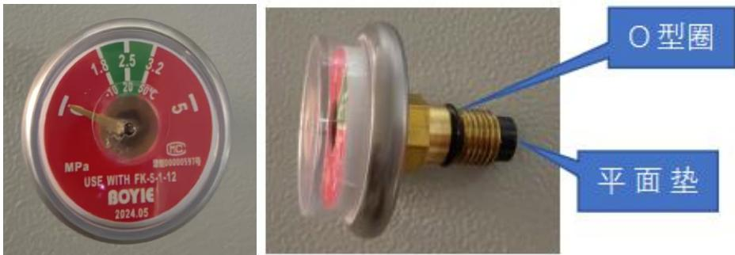  
图 7-1 压力表组件

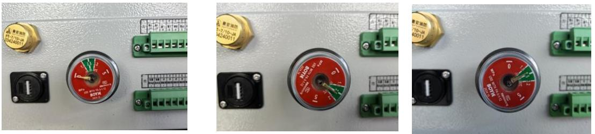  
图 7-2 检查压力前图  
7-3 检查压力  
7-4 检查压力复位后

1）检查配件，压力表安装前需检查 O 型圈、平面垫圈是否存在；

2）涂抹润滑脂，O 型圈和垫圈在装之前应涂抹润滑脂（出厂前会先涂抹）；

3）检查压力，安装时应顺时针缓慢旋转压力表表盘，直至观察到压力表指针转动后停止旋转，待压力表指针旋转稳定后查看指针是否停留在绿色区域，若超出绿色区域请及时联系厂家；

4）压力表复位，在检查压力后，压力表逆时针旋转 1 圈即可，此时可忽略压力表指针位置；

# 注意事项：

1）压力表为精密仪表，不能摔、碰撞，如若在安装压力表时，压力表发生碰撞或摔地后，应重新检查仪表，必要时进行更换。

2）压力表复位操作时由于阀门上带压，会存在一定的阻力，此为正常现象。

3）压力表复位可逆时针旋转 1圈-1.5 圈，若操作时听到噗的声音或压力表指针归0，则重新顺时针拧  
1 圈压力表（确保O型圈进入到阀体内）。

# 7.6.3 系统联动测试

按年度进行系统联动测试，验证机箱内阀组状态、复合传感器、消防控制器以及其他相关部件功能是否完好。

温馨提醒：进行联动测试前，应将机箱上状态切换开关（序号 3）转入“屏蔽”档位。

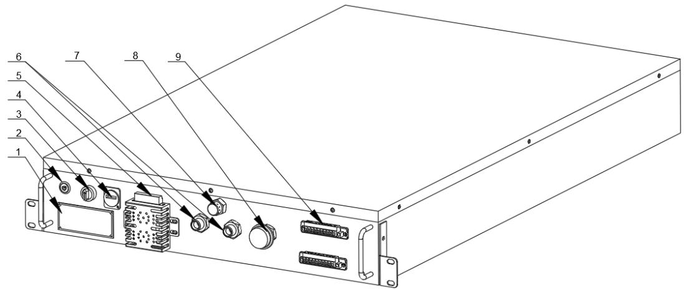  
图 7-5 机箱模型图

1-系统铭牌、2-开关按钮、3-状态切换开关、4-USB 程序下载口、5-复合型传感器、6-簇级管道出口、7-全淹没喷嘴、8-机械压力表、9-10P 接线端子

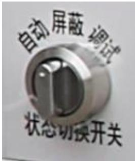  
图 7-6 状态切换开关

# 7.6.3.1 准备工具

二合一烟温火焰燃气检测仪（可模拟烟雾、温度）、CO 标气（300PPM，精度±50PPM）带集气罩；

# 7.6.3.2 一级触发

验证内容：  

<table><tr><td colspan="1" rowspan="1">告警级别</td><td colspan="1" rowspan="1">条件</td><td colspan="1" rowspan="1">输出响应</td></tr><tr><td colspan="1" rowspan="1">一级报警</td><td colspan="1" rowspan="1">①复合传感器C0≥300PPm，持续3秒；②复合传感器温度≥65℃，持续3秒；③复合传感器烟雾触发报警持续3秒；</td><td colspan="1" rowspan="1">1．CO 浓度数据/温度数据/烟雾状态通过ModBus 协议上传至上位机；协议地址如下：温度：地址5CO 浓度：地址6</td></tr><tr><td></td><td></td><td>烟雾状态：地址7 2．声光警报器动作 注：条件消失，输出响应复位。</td></tr></table>

验证步骤：

1) 将气体对准复合传感器CO 探头位置持续一段时间，待其达到所设定阈值后，会触发以下动作： $\textcircled{1}$ 柜体上声光警报器应发生报警； $\textcircled{2}$ 柜体上风扇会启动进行排气； $\textcircled{3}$ 系统 BCMS 系统控制断开直流接触器。撤去气体，待气体浓度散去，声光警报器应停止报警,风扇应停止工作。

2) 烟雾触发采用实际触发方式，将二合一烟温测试专用工具调至烟气档位，对准复合传感器烟雾传感器位置持续一段时间，待其达到所设定阈值后，会触发以下动作： $\textcircled{1}$ 柜体上声光警报器应发生报警； $\textcircled{2}$ 系统BCMS 系统控制断开直流接触器。撤去烟气，待烟雾颗粒散去后，声光警报器应停止报警。

3) 温度触发采用实际触发方式，将二合一烟温测试专用工具调至温度档位，对准复合传感器温度传感器部位持续一段时间，待其达到所设定阈值后，会触发以下动作： $\textcircled{1}$ 柜体上声光警报器应发生报警； $\textcircled{2}$ 系统BCMS 系统控制断开直流接触器。撤去温度专用工具，待温度低至 $6 5 \mathrm { { ^ \circ C } }$ ，声光警报器应停止报警。

# 7.6.3.3 二级触发（Pack）

验证内容：  

<table><tr><td colspan="1" rowspan="1">告警级别</td><td colspan="1" rowspan="1">条件</td><td colspan="1" rowspan="1">输出响应</td></tr><tr><td colspan="1" rowspan="1">二级火警（Pack级）</td><td colspan="1" rowspan="1">左簇：消防控制器主机接收 BSMS下发信号：①6#-10#pack BMS 最高温度告警（Tmax≥70℃）持续3s+复合传感器CO≥300PPm，持续3秒；②6#-10#pack BMU 报故障（离线故障持续150s或温度采样故障持续150s或电压采样故障持续150s）+复合传感器CO≥300PPm，持续3秒;以上为或的关系右簇:消防控制器主机接收 BSMS下发信号：</td><td colspan="1" rowspan="1">1.二级告警干节点输出;对应物理接线端子：P2 端子3,4端口2.二级告警通讯反馈;对应协议地址：地址43.消防硬件联动：3.1瓶组容器阀启动;3.2 右簇：两位三通刺破阀1启动；地址：8第1位左簇：两位三通刺破阀2启动；地址：8第2位3.3声光警报器动作;</td></tr><tr><td></td><td>①1#-5#pack BMS 最高温度告警（Tmax ≥70℃）持续3s+复合传感器C0≥ 300PPm，持续3秒； ②1#-5#pack pack BMU 报故障（离线 故障持续150s或温度采样故障持续 150s 或电压采样故障持续150s）+复合 传感器CO≥300PPm，持续3秒； 以上为或的关系</td><td>对应物理接线端子：P2 端子7,8口; 注：二级告警状态、声光警报器锁存，灭 火剂喷放为单次喷放，状态仅可重启控制 器复位。</td></tr></table>

验证步骤：

左簇触发用 BCMS 向消防系统下发 6#-10#PACK 热失控指令,右簇触发用 BCMS 向消防系统下发 1#-5#PACK 热失控指令，同时用 CO气体触发复合传感器 CO 达到 300PPM。达到触发条件后，应触发以下动作 $\textcircled{1}$ 柜体上声光警报器应发生报警； $\textcircled{2}$ 柜体上风扇会启动进行排气； $\textcircled{3}$ 系统 BCMS 系统控制分闸直流接触器； $\textcircled{4}$ 系统 BCMS 系统分闸交流接触器； $\textcircled{5}$ 组态界面上对应阀组状态发生变化：瓶组电磁阀、两位三通刺破阀（右簇为两位三通刺破阀1，左簇为两位三通刺破阀 2）变为启动状态（持续时间约 5s）。

# 7.6.3.4 二级触发（舱级）

验证内容:  

<table><tr><td>告警级别</td><td>条件</td><td>输出响应</td></tr><tr><td>二级火警 （舱级）</td><td>①复合传感器烟雾触发+复合传感器温度≥ 65℃; ②复合传感器C0 浓度≥300PPm+复合传感 器温度≥65℃； 以上为或的关系</td><td>1.二级告警干节点输出 对应物理接线端子：P2 端子3,4端口 2.二级告警通讯反馈 对应协议地址：地址4 3.消防硬件联动： 3.1消防灭火瓶组启动8s; 3.2舱级释放组件启动8s 注：阀组自行复位。二级告警状态、 声光警报器动作锁存，灭火剂喷放为 单次喷放，状态仅可重启控制器复 位。</td></tr></table>

验证步骤：

1）触发对象：复合传感器烟雾触发 $^ +$ 复合传感器温度 ${ \geqslant } 6 5 \mathrm { ~ \textbar { ~ C } ~ }$ 将二合一烟温测试专用工具调至温度档位，对准复合传感器温度传感器位置持续一段时间（使其满足${ \geqslant } 6 5 \mathrm { { ‰} }$ ），同时将二合一烟温测试专用工具调至烟气档位，对准复合传感器烟雾传感器位置持续一段时间，达到触发条件后，应触发以下动作： $\textcircled{1}$ 柜体上声光警报器应发生报警； $\textcircled{2}$ 柜体上风扇停止排气； $\textcircled{3}$ 系统 BCMS系统控制断开直流接触器； $\textcircled{4}$ 系统 BCMS系统断开交流接触器； $\textcircled{5}$ 系统上位机组态界面中：瓶组电磁阀、舱级释放组件变为启动状态（持续时间约 8s）。

2）触发对象：复合传感器 CO 浓度 $\geqslant 3 0 0 \mathsf { P P m } +$ 复合传感器温度 ${ \geqslant } 6 5 \mathrm { { ‰} }$ 用 CO 气体对准复合传感器 CO 探头，待浓度达到300PPM 后，排烟风机开启，将二合一烟温测试专用工具调至温度档位，对准复合传感器温度传感器位置持续一段时间（使其满足 ${ \geqslant } 6 5 \mathrm { { ‰} }$ ）。达到触发条件后，应触发以下动作： $\textcircled{1}$ 柜体上声光警报器应发生报警； $\textcircled{2}$ 柜体上风扇停止排气； $\textcircled{3}$ 系统 BCMS 系统控制断开直流接触器； $\textcircled{4}$ 系统 BCMS 系统断开交流接触器； $\textcircled{5}$ 系统上位机组态界面中：瓶组电磁阀、舱级释放组件变为启动状态（持续时间约8s）。

# 7.7 功率回路及主开关回路检查

1 紧固电网、电池连接电缆的螺栓。

2 紧固地线（PE）及柜体其他地线。

3 检查主回路的各类开关，包括主断路器和熔断器等。

# 7.8 UPS 检查

1 正常使用时，需每隔12个月进行检查 UPS是否正常工作，闭合 QF3，储能柜柜门的电源指示灯正常，则UPS市电回路正常，反之，需要检测 UPS市电回路；断开QF3，闭合QF5，储能柜柜门的电源指示灯正常，则电池回路正常，反之，需要检测 UPS电池回路。

2 不使用时，UPS 与电池连接必须断开 QF5（UPS 电池回路开关）。

3 长时间不用时，需每隔一个月进行上电检查：

1）市电回路检查：闭合 QF3，储能柜柜门的电源指示灯正常，则 UPS 市电供电回路正常，反之，则 UPS 故障。

2）备电回路检查：

断开QF3，闭合 QF5（UPS 电池回路开关），储能柜柜门的电源指示灯正常，则电池回路正常，反之，需要检测 UPS 电池回路。。

4 如未按要求操作导致电池的过放损坏，本司概不负责。

# 7.9 信号电路检查

端子、接插连接处每年检查是否有松脱。

# 7.10 系统清洁

1 用毛刷将机柜内部的灰尘清洁并取出。清洁人员必须是符合相关安全规定的人员。必须使用真空吸尘器和刷子清洁设备，同时对难以直接触及的地方使用高压气体。

2 清洁防尘罩的灰尘。

3 储能柜底部前门有防尘棉需要定期清洗或更换，若防尘棉长时间不清洗，积灰严重会堵塞风道，导致内部器件过温保护。防尘棉正常建议3-6个月清洗一次，特殊区域灰尘较多的情况下，需要1-2 月清洗一次。尘棉维护时需打开柜门，拆开百叶窗，防尘棉位置如图7-7所示。

注：防尘棉规格为： 45PPI 聚氨酯防尘棉，尺寸 $\mathsf { W } ^ { \star } \mathsf { H } ^ { \star } \mathsf { D } { = } 6 4 0 ^ { \star } 4 1 5 ^ { \star } 1 0 \mathsf { m m } .$ 。

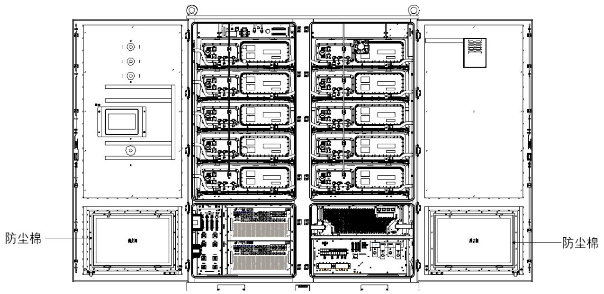  
图 7-3 防尘棉位置示意图

# 7.11 安全功能检查

1 检查紧急停机电路是否有松脱。

2 按下急停按钮是否能紧急停机；旋转复位后，能正常恢复。

# 7.12 接地可靠性检查

1 检查系统内各个机柜外壳保护接地。

2 检查系统防雷接地。

# 7.13 标签脱落检查

标签上的警示标识包含有对储能柜进行安全操作的重要信息，在每次进行系统维护时，当发现有标签脱落时，请及时粘贴新的标签。

# 7.14 部件维护

# 危险

在通电时，禁止对本产品进行维护操作。断开电源后，需要等待不少于5min，否则设备的残余电荷会对人身造成伤害。

⚫ 没有经过本公司授权的专业培训人员请勿对本产品实施维修及保养,否则可能造成人身伤害或设备损坏。

所有可插拔插件必须在断电情况下插拔，否则可能损坏设备。

严禁将线头或工具遗留在机器内，否则可能发生火灾或损坏财物。

# 7.14.1 更换防雷器

因遭受感应雷或者过电流引起的防雷器损坏，更换步骤如下：

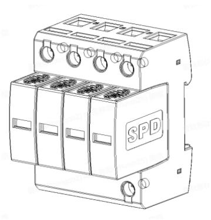  
图 6-2 防雷器示意图

1）检查防雷器指示条由绿色变成红色；

2）断开配电盒前面盖 QF1（交流总开关）；

3）使用万用表检查，确认下电；

4）拆卸下损坏的防雷器；

5）换入相同型号的防雷器；

6）重新闭合 QF1（交流总开关）。

# 7.14.2 更换熔断器

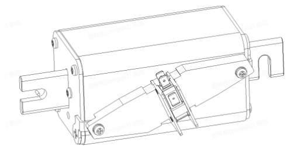  
图 6-3 熔断器示意图

1）熔断器故障，无法恢复；

2）储能柜停机；

3）断开配电盒前面盖QF1（交流总开关）；

4）使用万用表检查，确认下电；

5）拔下电池簇的快插连接器（此步骤需要佩戴绝缘手套）；

6）拆卸其他线缆；

7）抽出来控制盒，接着可以开盖并替换熔断器（必须相同型号！）。

# 7.14.3 更换接触器

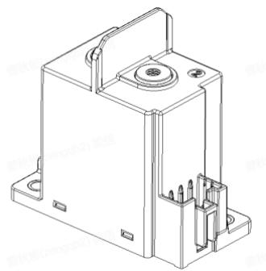  
图 6-4 接触器示意图

1）正/负极继电器粘连，无法恢复；

2）储能柜停机；

3）断开配电盒前面盖 QF1（交流总开关）；

4）使用万用表检查，确认下电；

5）拔下电池簇的快插连接器（此步骤需要佩戴绝缘手套）；

6）拆卸其他线缆；

7）抽出来控制盒，接着可以开盖并替换接触器（必须相同型号！）。

# 7.15 其他

当储能柜不能按照预期输出或充放电量发生异常变化时，在咨询本公司维护人员之前，请注意检查如下事项：

储能柜内所有开关状态；  
储能电池簇的开路电压；  
紧急停机旋钮是否处于按下状态；  
机柜和电网是否正确连接，并且通电；  
柜内的通讯是否正常。

本章节分开 GLC 和 LC 来介绍。

# 8.1 GLC 事件/故障排查

GLC 发生事件/故障时，主屏幕（或 WEB 端、云端）上将显示故障状态。

<table><tr><td rowspan=1 colspan=1>序号</td><td rowspan=1 colspan=1>事件/故障名称</td><td rowspan=1 colspan=1>说明</td><td rowspan=1 colspan=1>事件/故障排除</td></tr><tr><td rowspan=1 colspan=1>1</td><td rowspan=1 colspan=1>储能柜通信异常</td><td rowspan=1 colspan=1>储能柜不在线</td><td rowspan=1 colspan=1>检查储能柜连接至GLC 的网线是否掉线。如果事件仍然存在，请联系我司。</td></tr><tr><td rowspan=1 colspan=1>2</td><td rowspan=1 colspan=1>电表通信异常</td><td rowspan=1 colspan=1>电表不在线</td><td rowspan=1 colspan=1>检查各电表连接至GLC 的RS485线缆是否掉线。如果事件仍然存在，请联系我司</td></tr></table>

# 8.2 LC 事件/故障排查

LC 发生事件/故障时，HMI（或 WEB 端、云端）上将显示故障状态。

<table><tr><td colspan="1" rowspan="1">序号</td><td colspan="1" rowspan="1">事件/故障名称</td><td colspan="1" rowspan="1">说明</td><td colspan="1" rowspan="1">事件/故障排除</td></tr><tr><td colspan="1" rowspan="1">1</td><td colspan="1" rowspan="1">接触器粘连</td><td colspan="1" rowspan="1">接触器辅助触点变化跟实际不符</td><td colspan="1" rowspan="1">检查此故障是否为误报；若不是误报，请联系我司。</td></tr><tr><td colspan="1" rowspan="1">2</td><td colspan="1" rowspan="1">熔断器故障</td><td colspan="1" rowspan="1">熔断器辅助触点变化</td><td colspan="1" rowspan="1">检查此故障是否为误报；若不是误报，请联系我司。</td></tr><tr><td colspan="1" rowspan="1">3</td><td colspan="1" rowspan="1">储能柜 SPD 状态告警保护</td><td colspan="1" rowspan="1">SPD DI为0</td><td colspan="1" rowspan="1">检查配电盒的 SPD是否出现故障（指示条由绿色变成红色）；若出现，请替换新的 SPD。</td></tr><tr><td colspan="1" rowspan="1">4</td><td colspan="1" rowspan="1">储能柜AC 断路器分闸保护</td><td colspan="1" rowspan="1">AC 断路器DI为0</td><td colspan="1" rowspan="1">交流总进线开关跳闸。1）观察是否同步有消防类信号触发，及储能柜是否冒烟或火苗，若有请联系专业消防机构处理。2）观察是否同步有急停信号触发，若有先消除急停故障。</td></tr><tr><td colspan="1" rowspan="1">5</td><td colspan="1" rowspan="1">储能柜急停状态告警保护</td><td colspan="1" rowspan="1">急停DI为0</td><td colspan="1" rowspan="1">检查储能柜急停按钮是否有按下。如果事件仍然存在，请联系我司。</td></tr><tr><td colspan="1" rowspan="1">6</td><td colspan="1" rowspan="1">储能柜消防二级火警</td><td colspan="1" rowspan="1">二级火警DI为1</td><td colspan="1" rowspan="1">出现消防警情时候触发；请勿立即打开柜门；观察储能柜无冒烟无火苗，若有请联系专业消防机构处理。</td></tr><tr><td colspan="1" rowspan="1">7</td><td colspan="1" rowspan="1">储能柜探测器温度告警保护</td><td colspan="1" rowspan="1">温度485读取值≥65℃</td><td colspan="1" rowspan="1">出现消防警情时候触发；请勿立即打开柜门；观察储能柜无冒烟无火苗，若有请联系专业消防机构处理。</td></tr><tr><td colspan="1" rowspan="1">8</td><td colspan="1" rowspan="1">储能柜探测器烟雾告警保护</td><td colspan="1" rowspan="1">烟感 485 读取状态值4</td><td colspan="1" rowspan="1">出现消防警情时候触发；请勿立即打开柜门；观察储能柜无冒烟无火苗，若有请联系专业消防机构处理。</td></tr><tr><td colspan="1" rowspan="1">9</td><td colspan="1" rowspan="1">储能柜探测器 CO告警保护</td><td colspan="1" rowspan="1">CO 485读取值150PPM</td><td colspan="1" rowspan="1">出现消防警情时候触发；请勿立即打开柜门；观察储能柜无冒烟无火苗，若有请联系专业消防机构处理。</td></tr><tr><td colspan="1" rowspan="1">10</td><td colspan="1" rowspan="1">消防系统故障</td><td colspan="1" rowspan="1">485 读取状态值1</td><td colspan="1" rowspan="1">检查储能柜复合传感器是否出现故障；若探测器故障要替换，请联系我司。</td></tr><tr><td colspan="1" rowspan="1">11</td><td colspan="1" rowspan="1">储能柜触发全氟己酮喷放信号</td><td colspan="1" rowspan="1">485 读取状态值1</td><td colspan="1" rowspan="1">检查储能柜全氟己酮气瓶压力，若压力低要替换联系我司；压力正常检查反馈接线及端子。</td></tr><tr><td colspan="1" rowspan="1">12</td><td colspan="1" rowspan="1">除湿器故障</td><td colspan="1" rowspan="1">除湿器上报故障</td><td colspan="1" rowspan="1">检查储能柜除湿器是否出现故障；若出现要替换，请联系我司。</td></tr><tr><td colspan="1" rowspan="1">13</td><td colspan="1" rowspan="1">PCS故障</td><td colspan="1" rowspan="1">PCS 上报故障</td><td colspan="1" rowspan="1">检查储能柜 PCS 是否出现故障；若出现要替换，请联系我司。</td></tr><tr><td colspan="1" rowspan="1">14</td><td colspan="1" rowspan="1">液冷主机故障</td><td colspan="1" rowspan="1">液冷主机上报故障</td><td colspan="1" rowspan="1">检查储能柜液冷主机是否出现故障；若出现要替换，请联系我司。</td></tr><tr><td colspan="1" rowspan="1">15</td><td colspan="1" rowspan="1">PCS 交流掉电事件</td><td colspan="1" rowspan="1">PCS 三相交流电压，任意一相电压低于196V</td><td colspan="1" rowspan="1">检查电网是否出现断电情况，可使用万用表排查；待电网恢复正常后，故障解除。</td></tr><tr><td colspan="1" rowspan="1">16</td><td colspan="1" rowspan="1">PCS 通信异常</td><td colspan="1" rowspan="1">PCS不在线</td><td colspan="1" rowspan="1">检查储能柜PCS 的RS485 线缆是否掉线。如果事件仍然存在，请联系我司。</td></tr><tr><td colspan="1" rowspan="1">17</td><td colspan="1" rowspan="1">除湿器通信异常</td><td colspan="1" rowspan="1">除湿器不在线</td><td colspan="1" rowspan="1">检查储能柜除湿机的 RS485线缆是否掉线。如果事件仍然存在，请联系我司。</td></tr><tr><td colspan="1" rowspan="1">18</td><td colspan="1" rowspan="1">液冷主机通信异常</td><td colspan="1" rowspan="1">液冷主机不在线</td><td colspan="1" rowspan="1">检查储能柜液冷主机RS485 线缆是否掉线。如果事件仍然存在，请联系我司。</td></tr></table>

# 9.1 质量保证

# 证据

本公司在质保期内，要求客户出示购买产品的发票和日期。同时产品上的商标应清晰可见，否则有权不予以质量保证。

# 条件

更换后的不合格的产品应由本公司处理客户应给本公司预留合理的时间去修理出现故障的设备

# 责任豁免

因以下情况出现，本公司有权不进行质量保证：

当任意分解产品或没有正确进行维护而产生的问题；

整机、部件已经超出免费保修期；

超出相关国际标准中规定的操作使用范围；

没有按手册说明正确安装和操作而产生的问题；

因非正常自然环境引起的产品损坏；

因使用非标准部件或非本公司软件导致的机器损坏；

因外部设备损坏致使产品损坏；

因自行改造或维修本产品而造成的一切意外；

• 因为客户原因导致的系统故障尚未排除而强行上电导致的安全事故、财产损失、设备损坏。

因以上原因引起的产品故障，客户要求进行维修服务时，经我司服务机构判定可提供有偿维修服务。需要维修或改造本产品时，请事先联系我司。

# 9.2 免责声明

美的集团版权所有，保留一切权利。若设备使用人员未按手册标准规范操作，一切后果本司概不负责。

非经本司书面许可，任何单位和个人不得擅自摘抄、复制本文档内容的部分或全部，不得以任何形式传播。