# 科陆

用户手册汇流柜CLMG-1125

# 科陆

Copyright $\circledcirc$ 2024 深圳市科陆电子科技股份有限公司版权所有，保留一切权利。

非经本公司书面许可，任何单位和个人不得擅自摘抄、复制本文档内容的部分或全部，并不得以任何形式传播。

# 商标

以及本手册中使用的其他 CLOU 商标归深圳市科陆电子科技股份有限公司所有，本手册中提及的所有其他商标或注册商标归其各自所有者所有。

# 软件授权

禁止以任何方式将本公司开发的固件或软件中的部分或全部数据用于商业目的。

禁止对本公司开发的软件进行反编译、解密或其他破坏原始程序设计的操作。

深圳市科陆电子科技股份有限公司  
电话：0755-33309999  
传真：0755-26719679  
邮编：518057

总部地址：深圳市南山区高新技术产业园北区宝深路科陆大厦

# 科陆

修订记录  

<table><tr><td rowspan=1 colspan=1>版本</td><td rowspan=1 colspan=1>修订内容</td><td rowspan=1 colspan=1>修订人</td><td rowspan=1 colspan=1>修订时间</td></tr><tr><td rowspan=1 colspan=1>A0</td><td rowspan=1 colspan=1>初版</td><td rowspan=1 colspan=1>高熠坤</td><td rowspan=1 colspan=1>2025.03.03</td></tr><tr><td rowspan=1 colspan=1></td><td rowspan=1 colspan=1></td><td rowspan=1 colspan=1></td><td rowspan=1 colspan=1></td></tr><tr><td rowspan=1 colspan=1></td><td rowspan=1 colspan=1></td><td rowspan=1 colspan=1></td><td rowspan=1 colspan=1></td></tr><tr><td rowspan=1 colspan=1></td><td rowspan=1 colspan=1></td><td rowspan=1 colspan=1></td><td rowspan=1 colspan=1></td></tr></table>

版本：A0

尊敬的用户，非常感谢您使用深圳市科陆电子科技股份有限公司生产的工商业汇流柜产品,我们由衷的希望本产品能够满足您的需求，同时希望得到您对本产品使用过程中的建议！

本手册将为用户详解关于深圳市科陆电子科技股份有限公司生产的工商业汇流柜产品信息和安装使用说明，在使用前请仔细阅读本手册。

本手册著作权归本公司所有，保留一切权利。

本手册主要介绍汇流柜的运输与存储、机械安装、电气连接、上电投运与下电停运、故障处理和维护的方法。

# 读者对象

本手册适用于对本产品进行安装、调试、使用和维护的技术人员。在开始对产品进行操作之前请仔细阅读本手册。读者应该具备一定的电气、布线、电气元件、电气符号和机械原理图等基础知识。

# 产品服务及咨询

如果您想要了解更多产品信息、服务支持、产品与解决方案成功案例等可咨询我司。

# 手册警示符号

为了确保用户在使用产品时的人身及财产安全，更加高效优化地使用产品，手册中提供了相关的信息，并使用以下的符号加以突出强调。

以下列举了本手册中可能使用到的符号，请认真阅读从而更好地使用本手册。

# 危险

表示有高度潜在危险，如果未能避免将会导致人员死亡或严重伤害的情况。

# 警告

表示有中度潜在危险，如果未能避免可能导致人员死亡或严重伤害的情况。

# 小心

表示有低度潜在危险，如果未能避免将可能导致人员中度或轻度伤害的情况。

# 注意

表示有潜在风险，如果未能避免可能导致设备无法正常运行或造成财产损失的情况。

# 科陆

# 机体警示标贴

<table><tr><td rowspan=1 colspan=1>?</td><td rowspan=1 colspan=1>PE标识：此处为保护接地PE端，需要可靠接地，以保证操作人员以及设备的安全。</td></tr><tr><td rowspan=1 colspan=1>4</td><td rowspan=1 colspan=1>一般警告：该部件可能存在除高电压以外的危险，用户需注意！</td></tr><tr><td rowspan=1 colspan=1>达</td><td rowspan=1 colspan=1>静电警告：此部件可能会因为静电放电而受到损坏。</td></tr><tr><td rowspan=1 colspan=1>A</td><td rowspan=1 colspan=1>危险电压警告：该部件可能存在高压危险，用户需格外注意！</td></tr><tr><td rowspan=1 colspan=1>血</td><td rowspan=1 colspan=1>热表面警告：注意灼热表面，防止烫伤！</td></tr><tr><td rowspan=1 colspan=1>?</td><td rowspan=1 colspan=1>触摸警告：此部件有高温等危险，不可直接触摸。</td></tr><tr><td rowspan=1 colspan=1>四</td><td rowspan=1 colspan=1>参考用户手册提示：操作前请参考用户手册的对应说明事项。</td></tr><tr><td rowspan=1 colspan=1>?</td><td rowspan=1 colspan=1>噪音提示：产品在工作时可能会产生较大噪声，有必要时请佩戴耳塞以保护耳朵。</td></tr></table>

# 目录

修订记录.. 3

关于本手册.

1 安全注意事项.

1.1 运输和存储.

1.2 机体警示标贴.

1.3 配线 ..

1.4 运行和调试 ..

1.5 维护 ..

1.6 产品安全 ..

1.7 其他注意事项.

1.8 安装 ...

1.9 产品报废及回收 .

产品描述. .6

2.1 产品概述 . .6

2.2 外观设计 .......

2.2.1 外观介绍 .. 6

2.3 机械参数 ..

2.4 内部设计 .. .8

2.4.1 内部设备布局 .. 8  
2.4.2 操作开关位置总览. 8  
2.4.3 电缆入口设计 .. 9

机械安装.. .10

3.1 运输条件 .. ..10

3.2 设备运输 . 11

3.3 建造地基 .. .12

3.3.1 安装地点选择 .. . 12  
3.3.2 地基选择 .. . 12  
3.3.3 其他防护措施 . . 13

3.4 固定安装 .. .13

4 电气连接.. .15

4.1 安全注意事项.. .15

4.1.1 总则 .. . 15  
4.1.2 五大安全法则. 17

4.2 接线总览 .. .17

4.3 接线零部件. .18

4.3.1 铜线接入 .. . 18

4.4 电气接线准备. .19

4.4.1 安装工具 .. . 19

4.4.2 制作接线端子. . 19

4.4.3 打开柜门 .. .. 20

4.4.4 线缆入口设计 . . 21

4.4.5 检查线缆 . . 21

4.4.6 接线时注意事项. . 21

# 4.5 接地连接 . .. 21

4.5.1 简介 .. .21  
4.5.2 内部设备等电位连接. .22  
4.5.3 外部接地 . 22

4.6 汇流柜对外接线.. . 23

4.6.1 安全注意事项. .23  
4.6.2 汇流柜至储能柜接线. .24  
4.6.3 汇流柜与电网接线.. . 25

5 上下电操作 . .. 27

5.1 上电投运 .. . 27

5.1.1 上电前检查 27  
5.1.2 上电步骤 . .27  
5.1.3 下电操作 . 27

6 维护说明 .. . 28

6.1 维护前注意事项.. . 29  
6.2 维护项目及周期. . 29  
6.3 故障排查 .. . 30  
6.4 故障排查 .. . 31

质保与免责 ... . 32

7.1 质量保证 .. . 32

7.2 免责声明 . . 32本章介绍了在对本产品进行运输和存储、安装、配线等操作时需遵守的安全注意事项。在对本产品进行安装、配线等操作之前，请仔细阅读安全注意事项。在操作过程中需要严格遵守安全注意事项。忽视安全注意事项可能会造成设备损坏，甚至人身伤亡。

# 1.1 运输和存储

# 危险

1) 搬运产品时，应轻抬轻放，否则可能损坏产品。

2) 设备必须竖直运输，运输过程中，应避免设备倾斜，否则可能造成人身伤害。

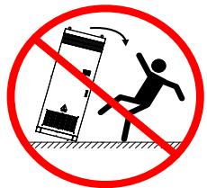

# 警告

在运输和存储期间，应避免产品受到物理性的冲击和振动。

存储要求：

1) 存储前，应保证汇流柜柜门及内部各设备柜门锁紧。

2) 存储环境温度： $- 3 0 ^ { \circ } \mathrm { C } ^ { \sim } { + } 5 5 ^ { \circ } \mathrm { C }$ 。

3) 存储环境相对湿度： $0 ^ { \sim } 9 5 \%$ ，无冷凝。

4) 对汇流柜的进风口和出风口加以有效防护，同时采取有效措施防止雨水，沙尘等侵入到柜体内部。

5) 定期巡检。至少每半月巡检一次，检查柜体及内部各设备是否完好无损。

6) 对长期存储（存储时间超过半年）的汇流柜进行安装前，应先打开柜门进行目测检查，目测柜子外观无凝露。确定柜体及内部设备是否完好无损。同时，需要通电、启动后进行检查。必要时须经专业人员进行测试后再进行安装。

7) 定期巡检，检查包装是否完好无损，避免虫鼠蛀咬，如发现破损应立即更换、包装箱不可倾斜或倒置。

# 1.2 机体警示标贴

产品的机柜内外部可能贴有警示标贴，其含义如下：

<table><tr><td rowspan=1 colspan=1></td><td rowspan=1 colspan=1>接地保护</td></tr><tr><td rowspan=1 colspan=1>ATTENTIONOBSERVEPRECAUTIONSELECTROSTATICSENSITIVEDEVICES</td><td rowspan=1 colspan=1>静电敏感元件</td></tr><tr><td rowspan=1 colspan=1>今高江险接通电源前必须可靠接地ATTENTIONDANGER, HIGH VOLTAGEGROUNDEDBEFORECONNECTWITHSOURCE</td><td rowspan=1 colspan=1>高压危险警示</td></tr><tr><td rowspan=1 colspan=1>A  注意大漏电流接通电源前必须可靠接地ATTENTIONHIGH LEAKAGE CURRENTGROUNDEDBEFORECONNECTWITHSOURCE</td><td rowspan=1 colspan=1>大漏电流警示</td></tr></table>

# 1.3 配线

# 危险

1) 所有外围配件的接线，必须遵守本手册的指导，按照本手册所提供电路连接方法正确接线，否则会出现危险。

2) 请在接线前，确认电源处于关闭状态。

3) 请按标准对本产品进行正确规范接地。

4) 注意输出端子的标记，严禁接错线，否则可能损坏设备。

5) 导线线径须参考手册的建议来选择，否则可能发生事故。

6) 上电后非必要不要打开本产品的面板，否则有触电的危险。

7) 上电后严禁用湿手触摸本产品及周边电路，否则有触电危险。

8) 上电后严禁触摸本产品的任何输入输出端子，否则有触电危险。

9) 在测试动力电缆等其他外部设备前，请将它们与本产品的连接线缆卸掉，以防意外损坏。

# 注意

1) 应当确认输入电源的电压等级是否和本产品的额定电压等级一致。

2) 本产品的任何部分无须进行耐压试验，出厂时产品已做过此项测试，否则可能发生事故。

3) 应确保配线路符合 EMC 要求及所在区域的安全标准。

# 1.4 运行和调试

# 告警

1) 运行中严禁触摸散热出风罩和百叶窗，否则可能引起灼伤。  
2) 严禁在运行中人为检测信号，否则可能引起人身伤害或设备损坏。  
3) 运行中，应避免杂物掉入设备中。  
4) 运行时，不要遮盖产品的通风孔。  
5) 运行时，请不要打开本产品的门或面板。

# 1.5 维护

# A 危险

1) 在通电时，禁止对本产品进行维护操作。断开电源后，需要等待不少于 5min，否则设备的残余电荷会对人身造成伤害。  
2) 没有经过本公司授权的专业培训人员请勿对本产品实施维修及保养,否则可能造成人身伤害或设备损坏。  
3) 所有可插拔插件必须在断电情况下插拔，否则可能损坏设备。  
4) 严禁将线头或工具遗留在机器内，否则可能发生火灾或损坏财物。

# 1.6 产品安全

为了安全使用产品，请相关技术人员仔细阅读以下要求！否则由以下原因引起的部件损坏或异常、财产损失、安全事故等，不在本公司的责任范围内。

1) 客户没有根据配套设备用户手册对系统进行正确的维护保养。

2) 将系统与易燃/易爆等材料一同存放或安装造成的产品损坏或其他财产损失。

3) 系统相关操作须由专业人员执行，操作时未佩戴符合标准的防护装备所造成的人身安全事故、财产损失等。

# 1.7 其他注意事项

1) 额定电压值以外的使用

不允许在工作电压范围之外使用本产品。如果需要，请使用相应的升压或降压装置进行变压处理。

2) 海拔高度与降额使用

在海拔高度超过 $2 0 0 0 \mathrm { m }$ 的地区，由于空气稀薄造成本产品的散热效果变差，有必要降额使用。此情况请向我公司进行技术咨询。

3) 恶劣天气环境下的使用

在当地天气预警为暴雨大风黄色预警以上、沙尘暴等恶劣环境时需断电，重新上电使用时需打开柜门检查是否有异常。

# 1.8 安装

# 告警

1) 请将本产品安装在阻燃的物体上，远离可燃物，否则可能引起火灾。

2) 不要将本产品安装在含有爆炸性气体的环境里，否则有引发爆炸的危险。

3) 不要将本产品安装在有机械振动的基座上。

4) 安装时，请保证本产品的安装环境通风散热良好。当两个以上的本产品相邻放置时，请注意安装位置，以保证散热效果。

5) 安装和维护时，需要防止液体、灰尘或者碎屑进入本产品内部，因为导电的液体和碎屑可能会引起本产品内部短路，从而导致设备损坏。

6) 在连接外部电缆和本产品内部电缆时，必须确保电缆的安装力矩正确，过小的力矩可能使接触电阻变大，导致过热，过大的力矩可能使螺钉疲劳损坏。

# 1.9 产品报废及回收

1 回收概述

汇流柜含有多种可回收或有害材料，必须按照环保要求进行妥善处理。遵循以下指示，确保设备的回收过程符合环境保护的标准，并最大限度减少对环境的影响。

# 2 回收准备

在拆卸和回收汇流柜前，请确保设备已经完全断电并且不会对操作人员造成伤害。以下是回收前的准备工作：

断电步骤：确保与电网或其他电力来源的连接已经断开。

防护设备：操作人员应穿戴绝缘手套和防护服。

3 回收步骤

电气和电子元件：

机柜内的电子元件，包括控制单元、电缆等，可能含有有害物质，应拆卸并交由电子废弃物回收机构。

拆卸时避免破坏电路板，以防有毒物质泄漏。

金属结构：

机柜外壳、框架等金属部件可回收再利用。将金属件送至当地的金属回收站。

请确保回收过程中清除表面污物和油脂。

塑料与其他材料：

机柜中可能包含塑料和其他非金属材料。根据材料标识，将可回收塑料送至当地的回收设施。

4 注意事项

禁止自行拆解：用户禁止自行拆解储能一体机柜，请联系专业人员进行操作。  
符合当地法规：回收和处理流程应符合设备所在地的环保法规。  
联系回收服务：我们建议用户联系当地的电子废物或电池回收服务商，确保回收处理合法合规。

# 5 回收服务联系方式

如需更多帮助，请联系本公司或当地的回收服务提供商。

# 2.1 产品概述

本款汇流柜主要用于工商业场景，集成了多储能柜汇流开关、本地控制器和系统配电等。  
汇流柜的防护等级为 IP54,可以在室外工作，最大支持 9 台额定 ${ \mathsf { 1 2 5 } } { \mathsf { k W } }$ ，400VAC 规格的储能柜汇流接入。

# 2.2 外观设计

# 2.2.1 外观介绍

表 2-1 汇流柜外观

# 视图

说明前视图

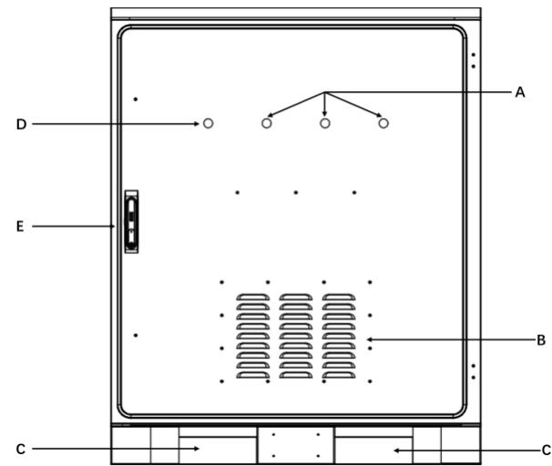

A：运行指示灯B：散热孔  
C：叉车孔  
D：故障指示灯E：前门门锁

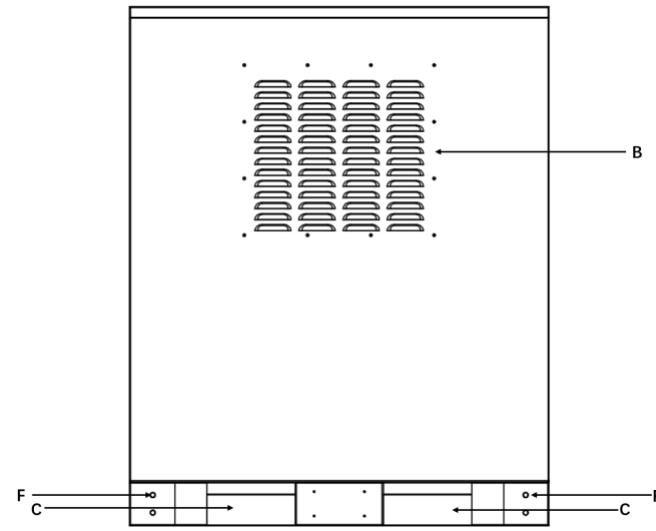

\*以上图片仅供参考，请以收到的实物为准！

后视图

F：接地孔

LED 指示灯

在汇流柜的上端安装有4个显示设备带电及运行状态的 LED 灯，分别为带电指示灯“PWR”，运行指示灯“RUN1、RU2、RUN3”。

表 2-2 LED 指示灯说明  

<table><tr><td>名称 颜色</td><td>说明</td></tr><tr><td>电源 绿色</td><td>系统主回路已上电</td></tr><tr><td>运行</td><td>绿色 正常运行</td></tr></table>

表 2-3 LED 显示状态及运行说明  

<table><tr><td>名称</td><td>颜色</td><td>说明</td></tr><tr><td>：</td><td></td><td></td></tr><tr><td>RUN</td><td>绿色</td><td>系统正常运行或带电状态</td></tr></table>

# 2.3 机械参数

汇流柜尺寸汇流柜的外观和尺寸如下图所示

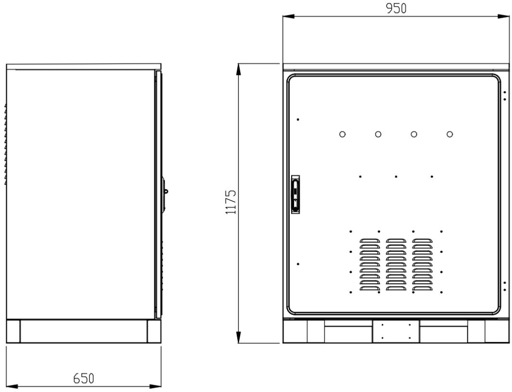  
图 2-1 汇流柜尺寸图

\*以上图片仅供参考，请以收到的实物为准！

# 2.4 内部设计

# 2.4.1 内部设备布局

汇流柜的开门布局图如下图 2-2所示。

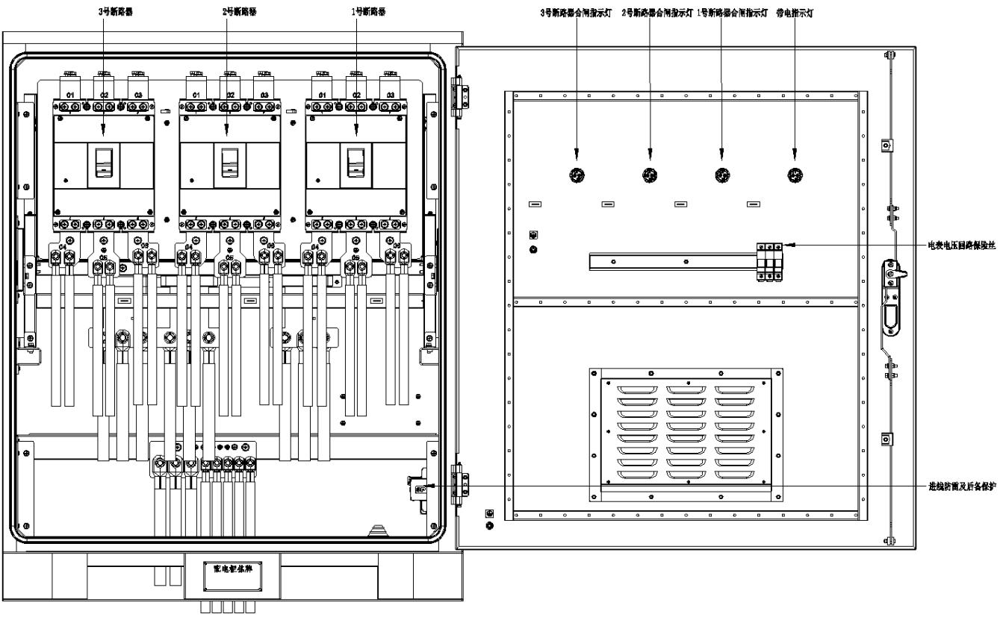  
图 2-2 汇流柜内部布局图

\*以上图仅供参考，请以收到的实物为准！

# 2.4.2 操作开关位置总览

汇流柜各断路器位置如下所示：

汇流柜：QF1 用于切除/保护储能柜 1\~3#；QF2用于切除/保护储能柜4\~6#（若有需要）；QF3用于切除/保护储能柜 7\~9#（若有需要）。

科陆

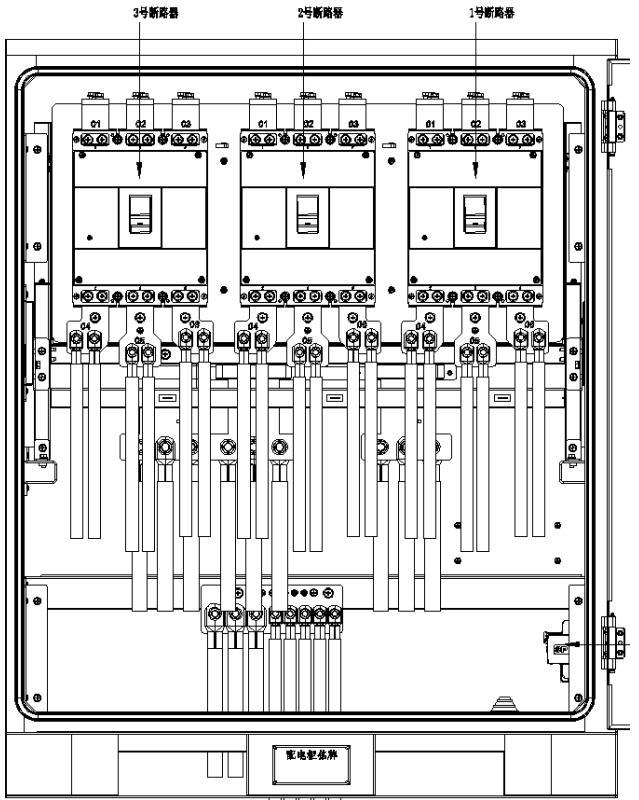  
图 2-3 操作开关位置总览

# 2.4.3 电缆入口设计

为了在现场方便地进行电缆连接，在交付之前已连接汇流柜内部设备的所有电缆。  
连接汇流柜和外部设备的电缆可以从底部电缆入口进入内部，长度根据施工现场而定。

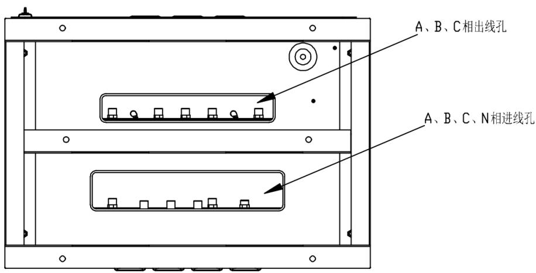  
图 2-4 汇流柜（俯视图）线缆入口定义

# 告警

在机械安装的全过程中，必须严格遵守项目所在地的相关标准和要求。

# 3.1 运输条件

汇流柜内的各种设备在出厂前都已经安装固定在汇流柜内，运输时对汇流柜进行整体运输即可。

# 告警

1) 在装卸、运输的整个过程中，必须遵守项目所在国家/地区的户外柜作业安全规程！

2) 对储能柜的作业中使用的任何机具，均应经过维护。

3) 所有从事装卸和栓固的人员均应接受相应的培训，特别是安全方面的培训。

#

# 注意

在装卸、运输的整个过程中，需时刻牢记储能柜的机械参数。

运输移动汇流柜需要满足以下条件：

汇流柜各柜门紧锁。

根据现场条件，选择合适的叉车或叉运工具。所选工具必须具备足够的承重能力，臂长和旋转半径。

如果需要在斜坡上移动等，可能会需要额外的牵引装置。

清除移动过程中存在或可能存在的一切障碍物，如树木、线缆等。

应尽可能选择在天气条件较好的条件下对汇流柜进行运输移动。

务必设置警告牌或警示带，避免非工作人员进入叉车运输区域，以免发生意外。

# 科陆

# 3.2 设备运输

汇流柜的底部配有专门用于叉车运输的插孔（请参见下图），可通过叉车移动汇流柜。

# 告警

1) 通过底部前叉口或侧叉口移动汇流柜。

2) 在任何情况下，都不能通过将插脚插入叉孔以外的其他位置来移动汇流柜。

3) 在对设备进行移动的整个过程中，均需严格按照叉车的安全操作规程进行操作。

4) 移动的机器下方及周围严禁站人，避免发生伤亡事故。

5) 如遇恶劣天气条件，如大雨、大雾、强风等，应停止运输工作。

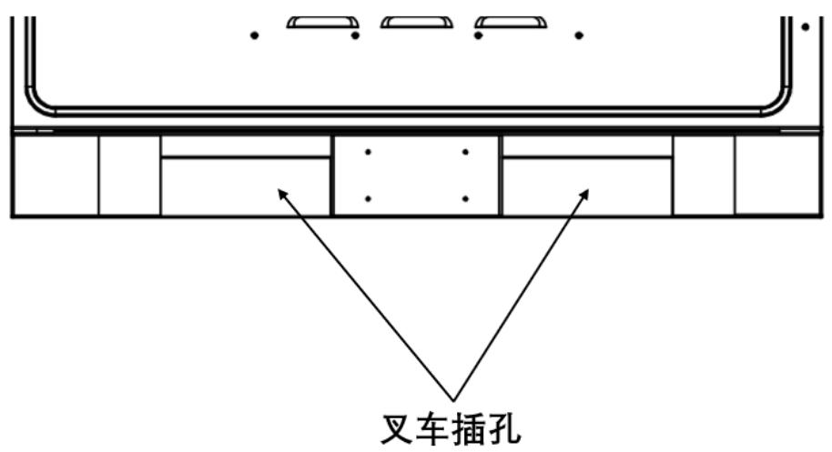  
图 3-1 机柜底部叉车孔位置示意图

如果使用叉车运输方法，则应满足以下要求：

叉车应配备足够的承载能力（至少 300Kg）。  
插入汇流柜的插脚则至少为 650mm。

插脚应插入工作站底部的叉形插孔中（有关叉形插孔的位置，请参见示意图）。

汇流柜的运输，移动和放下应为缓慢而稳定。建议尝试运输。  
只能将汇流柜放置在平稳的地方。该地方应排水良好，没有任何障碍或鼓起。该汇流柜应由四个底角件固定。

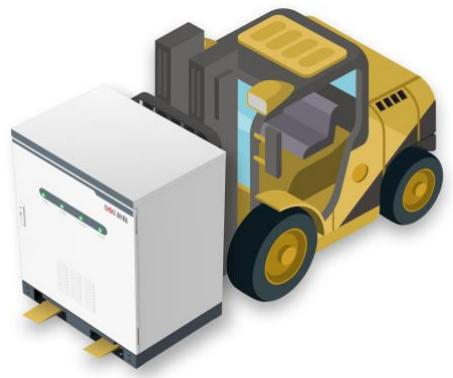  
图 3-2 叉车运输

\*此图仅供参考，请以收到的实物为准！

# 注意

交付前汇流柜的插孔是用封板密封起来的，柜体安装后需把封板安装回原位。

# 3.3 建造地基

# 3.3.1 安装地点选择

在选择安装场地时，请至少遵循下述原则：

应充分考虑汇流柜安装地的气候环境、地质条件（如应力波发射情况，地下水位）等特点。周围环境干燥，通风良好，远离易燃易爆区域。  
安装现场的土壤需要有一定的紧实度。建议安装场地土壤的相对密实度 $\geq 9 8 \%$ 。若土壤松散，请务必采取措施保证地基稳固。

# 3.3.2 地基选择

# 告警

汇流柜整体较重，在建造地基前应首先对安装场地各项条件（主要指地质条件和环境气候条件等）进行详细考察。只有在此基础上，才可开始地基的设计与建造工作。

不合理的地基建造方案会对汇流柜的放置，开关门及后期运行等带来较大困难或麻烦，因此，汇流柜的安装地基必须事先按照一定的标准进行设计建造，以满足机械支撑，线缆走线，后期维护检修等的要求。

建造地基时至少应满足下述要求：

建造地基的基坑底部务必夯实填平。

# 科陆

地基要足够为提供有效承重支撑，地基用钢筋混泥土制作，混泥土的抗压强度不能低于 C30(汇流柜单柜重量约 $3 0 0 \mathsf { k g } .$ )。  
抬高储能集成系统，防止雨水侵蚀汇流柜底座以及内部。建议地基高出安装现场水平地面约 $2 0 0 \mathsf { m m }$ 。需结合当地地质条件，建造相应的排水措施。  
建造足够横截面积和高度的水泥地基。地基高度由施工方根据现场地质来确定。  
建造地基时应考虑到线缆布线。  
维护平台围绕地基构建，为后期维护带来方便。  
根据汇流柜上电缆入口和出口的位置和尺寸，在基础施工中，要为交流电缆槽预留足够的空间，并预先其纳入电缆导管。  
根据电缆型号和进出线数量确定射孔管的规格和数量。  
所有预埋管的两端均暂时密封，以防止杂质进入；否则，后期布线不便。  
连接所有电缆后，电缆入口和出口以及接头均用耐火泥或其他合适的材料密封，以防止啮齿动物进入。

# 3.3.3 其他防护措施

# 注意

安装现场应建造有排水系统，避免储能柜底部或柜内设备在雨水充沛季节或大量降水时被水浸泡。

# 注意

请勿在安装场地周围近距离范围内种植树木。以防止大风刮倒树枝或刮落树叶堵塞储能柜柜门或进风口。

# 3.4 固定安装

在确认地基建造符合要求，且足够干燥、坚固、平整后，将汇流柜叉放至预定位置。

使用紧固螺栓将汇流柜固定在地基上。

推荐安装空间

汇流柜一般匹配储能柜进行使用，汇流柜可多面并柜安装，其左侧、右侧与相邻储能柜之间可以选择无需预留距离，也可适当预留一定空间（ $5 0 \mathsf { m m }$ ）。

机柜前方需预留至少 1000mm 方便开门进行安装、维护、布线等操作；

柜体后侧需散热和维护，建议离墙预留 500mm；

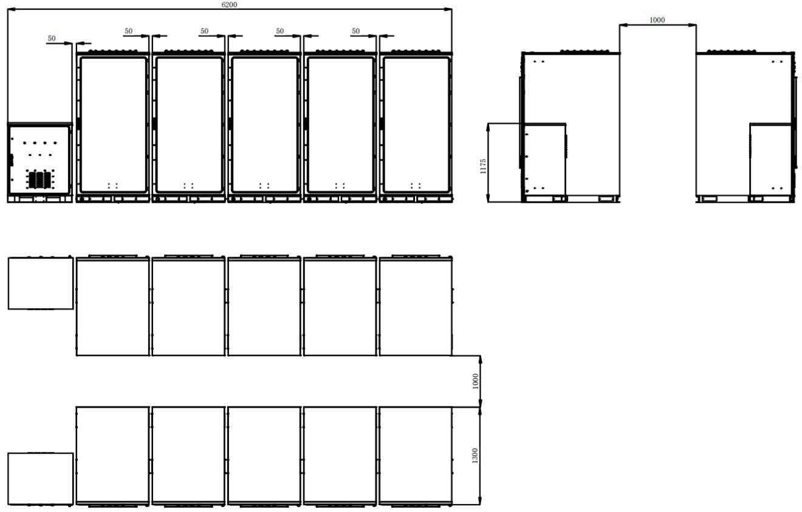  
图 3-3 储能柜并机安装示意图（5 台储能柜 $+ 1$ 台汇流柜举例）

# 4.1 安全注意事项

# 4.1.1 总则

# 危险

高压危险！电击危险！

1) 严禁触摸带电部分！  
2) 安装前请确保交直流侧均不带电。  
3) 请勿将储能集成系统置于易燃物表面。

# 危险

当汇流柜发生接地故障时，原本不带电的部分可能会存在致命高电压。若意外触碰，非常危险！操作前，请先确保系统没有接地故障发生，同时，也需做好相关的防护措施。

# 1 告警

1) 所有的电气连接必须符合项目所在国家/地区的相关标准和规范。

2) 仅当得到本地供电公司许可并由专业的技术人员安装完成后方可将汇流柜与电网侧相连接。

# 告警

只有专业的电工或者具备专业资格的人员才能对本产品进行电气连接。请严格按照设备内部的接线标识执行接线操作。接线前，需断开储能集成系统交直流侧。

# 告警

风沙及湿气的进入，可能会损坏储能柜内的电气设备，或影响设备运行性能！

1) 风沙季节，或当周围环境中相对湿度大于 $9 5 \%$ 时，应避免电气连接工作。

2) 在无风沙，且天气晴朗干燥时，再开始各项连接工作。

# 告警

如不遵守力矩要求可能会导致连接处起火！

在电气连接过程中，必须严格按照本手册中所描述的力矩对螺栓进行紧固。

# 告警

只有具备资质的电气工程师才能进行电气连接相关的工作。请遵守本手册 1 安全注意事项给出的各项要求。由于忽视这些安全须知而导致的人员伤亡或财产损失，本公司概不承担任何责任。

# 告警

在进行线缆敷设时，要保证电气绝缘并遵守EMC规范，功率电缆与电源及通讯线缆应分层敷设。并在必要时，为线缆提供保护及支撑，以减少电缆承受的应力。

# 告警

请严格按照设备内部的接线标识执行接线操作。

# 注意

1) 汇流柜的安装设计必须符合项目所在国家/地区的相关标准或规范。

2) 如果没有按照本手册给出的安装设计要求，或未遵照安装所在地相关电气标准或规范进行安装，而引起汇流柜或系统故障，将不在质保范围内。

# 4.1.2 五大安全法则

在进行电气连接的整个过程中，以及其他所有对汇流柜等设备施行的操作，均需遵守下述的五大安全法则：

• 断开汇流柜的所有外部连接，以及与设备内部供电电源的连接。  
• 确保各断开处不会被意外重新上电。  
• 使用万用表确保设备内部已完全不带电。  
• 施行必要的接地。  
• 对操作部分的临近可能带电部件，使用绝缘材质的布料进行绝缘遮盖。

# 4.2 接线总览

汇流柜接线图如下图所示：

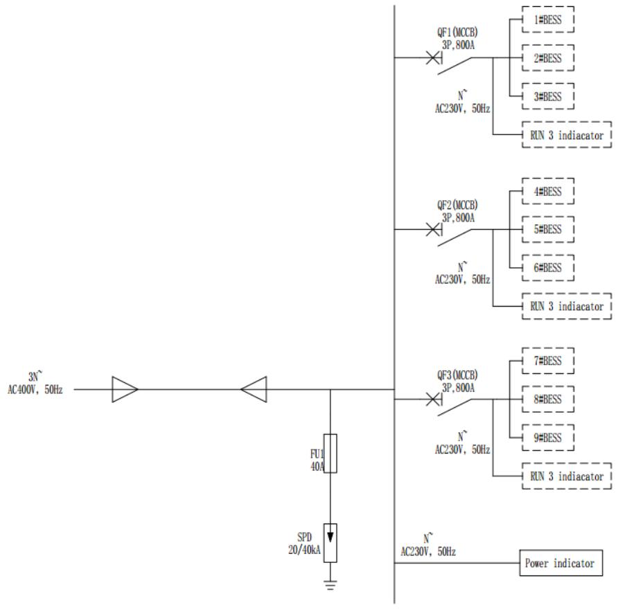  
图 4-1 电气拓扑图

# 告警

1) 所有的电气连接，均需严格按照接线原理图进行。

2) 所有的电气连接，都必须在设备完全不带电的情况下进行。

# 告警

只有具备资质的电气工程师才能进行电气连接相关的工作。请遵守本手册 “安全须知”给出的各项要求。  
由于忽视这些安全须知而导致的人员伤亡或财产损失，本公司不承担任何责任。

# 注意

1) 汇流柜的安装设计必须符合项目所在国家/地区的相关标准或规范。

2) 如果没有按照本手册给出的安装设计要求进行安装，而引起汇流柜或系统故障，将不在质保范围内。

# 4.3 接线零部件

# 告警

不正确的接线顺序可能导致起火燃烧。请注意接线部件的连接顺序。

连接时，确保连接件的紧固。若连接不充分或接触面氧化亦会引起热量过大，可能导致火灾。

# 注意

1) 选择螺钉长度应适当，稍露出安装孔即可，太长可能会影响设备绝缘性能，甚至造成短路。

2) 安装完成后，需检查接线铜鼻与铜排连接处，是否有部分热缩套管被夹，如被夹应及时去除，否则可能会导致接触不良，甚至损坏设备。

汇流柜功率电缆接线使用的固定螺钉等零件，设备交付时已经安装在相应铜排上。请严格遵照本节的描述对线缆进行连接。

# 4.3.1 铜线接入

若选择铜线缆，则接线零部件的连接顺序如下图所示。

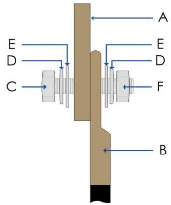  
图 4-2 铜端子连接顺序

<table><tr><td>编号</td><td>名称 编号</td><td>名称</td></tr><tr><td>A</td><td>铜排 D</td><td>弹垫</td></tr><tr><td>B</td><td>铜接线端子 E</td><td>平垫</td></tr><tr><td>C</td><td>螺栓 F</td><td>螺母</td></tr></table>

# 4.4 电气接线准备

# 4.4.1 安装工具

安装前需要至少准备如下的工具及零件：

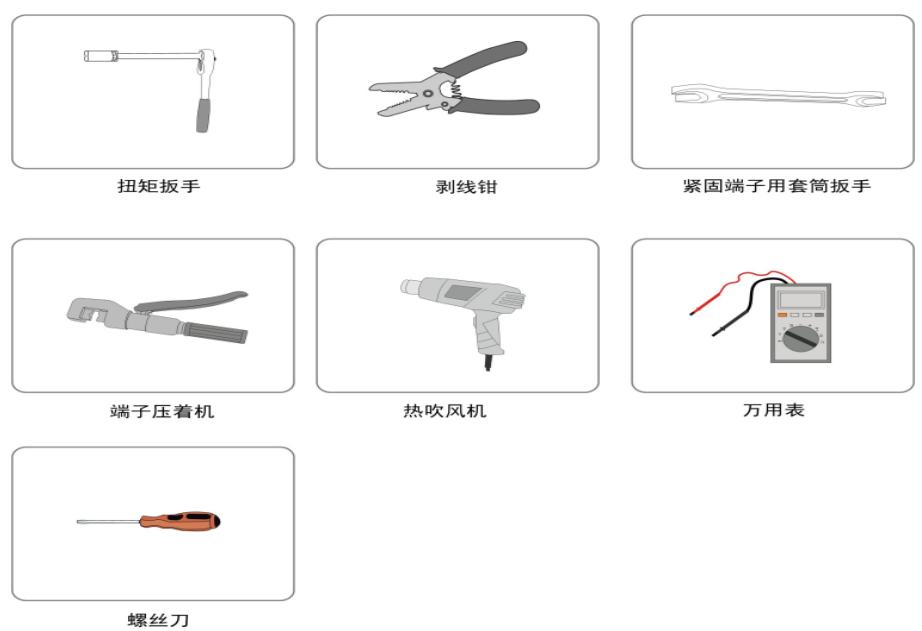

# 4.4.2 制作接线端子

按照下面所示步骤，制作接线端子。

步骤 1 剥掉电缆的绝缘皮，电缆末端的绝缘皮剥掉的长度应为接线铜鼻压线孔的深度另加 5mm 左右。

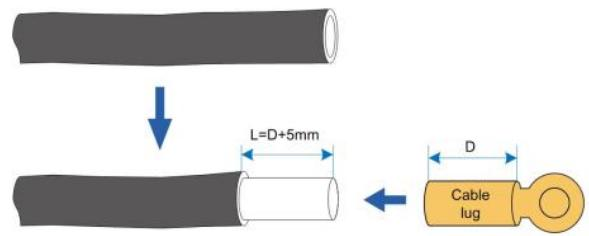

步骤 2 压接接线铜鼻。

1 将剥好的线头裸露的铜芯部分放到接线铜鼻的压线孔内。

2 使用端子压着机将接线铜鼻压紧。压接数量应在两道以上。

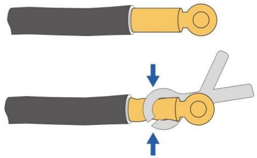

步骤 3 安装热缩套管。

1 选择与线缆尺寸较符合的热缩套管，长度应超出接线铜鼻压线管约 2cm。

2 将热缩套管套在接线铜鼻上，以完全覆盖接线铜鼻的压线孔为适。

3 用热吹风机是热缩套管缩紧。

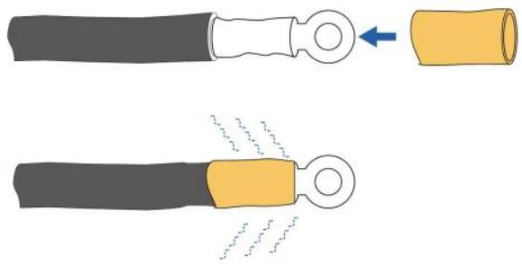

结束

# 4.4.3 打开柜门

在电缆连接之前打开门。

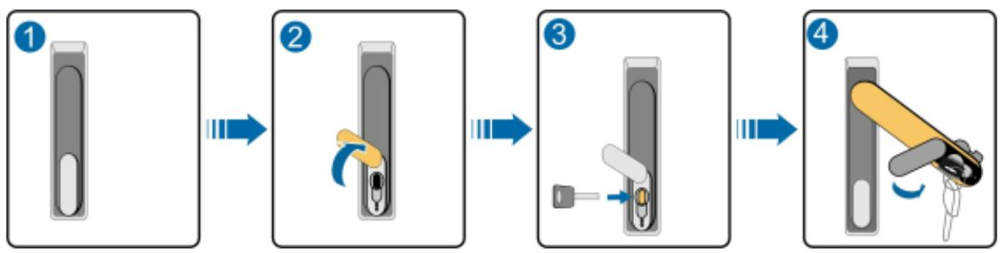  
图 4-3 开前门步骤

<table><tr><td>步骤</td><td>说明</td></tr><tr><td>1</td><td>锁定状态</td></tr><tr><td>2</td><td>将盖向上移到锁定孔上方</td></tr><tr><td>3</td><td>插入门钥匙并顺时针旋转</td></tr><tr><td>4</td><td>逆时针旋转手柄至图中所示的位置以打开前门</td></tr></table>

# 科陆

# 4.4.4 线缆入口设计

连接储能设备和外部设备的电缆可以从柜体的底部线缆入口进入内部，见 2.4.3 章节。

# 4.4.5 检查线缆

# 告警

在电气连接之前，检查以确保所有线缆的完整性和绝缘性。若存在破损的线缆，请及时更换。 绝缘不良或电缆损坏可能会造成危险。

汇流柜内部设备间的接线工作已在出厂前全部完成。用户需要：

• 检查连接线缆是否存在损伤，如果发现，请立即更换相同规格型号线缆。  
• 检查线缆连接处是否已紧固到位。确保所有接线端子均已紧固。

# 4.4.6 接线时注意事项

# 告警

1) 接线前，必须检查所有输入线缆的极性，确保每路输入极性均正确。

2) 在电气安装过程中，切勿用力拉扯线缆或导线，以免损坏其绝缘性能。

3) 所有线缆和导线均应保证有一定的弯曲空间。

4) 采取必要的辅助措施，减少线缆或导线承受的应力。

5) 每一步接线操作结束后，均需仔细检查，确保接线正确、牢固。

# 4.5 接地连接

# 4.5.1 简介

# 告警

接地连接必须符合项目所在国家/地区的接地标准及规范。

# 告警

接地线必须良好接地！除此以外：

1) 故障发生时可能导致致命的电击！

2) 闪电可能会损坏设备！

3) 设备可能无法正常运行！

# 注意

在接地期间，请注意：

1) 设备和接地电极之间的接地连接必须可靠地固定。  
2) 接地后测量接地电阻，接地电阻应不大于 0.1Ω（阻值需实际根据当地法规要求）。

# 4.5.2 内部设备等电位连接

出厂前，汇流柜内部主要电气设备至接地端子的接线均已完成。汇流柜与大地之间的连接需在现场完成，且在现场，需执行下述操作：

通过测量各设备接地端至总接地铜排的导电性，来确保各内部接地连接的有效性。

汇流柜对外连接各线缆的屏蔽层，保护层等，也应在汇流柜选择合适地点接地。

# 4.5.3 外部接地

# 告警

严格按照设备内部的接线标识进行电缆连接。

汇流柜包括内部接地和外部接地。关于接地，您可以选择接入柜外接地扁钢，也可以选择内部PE铜排。

交付之前，汇流柜内部设备的接地已完成。

请结合现场实际情况，并遵照电站工作人员的指示对外部接地进行安装。

接地连接结束后须测量接地电阻。

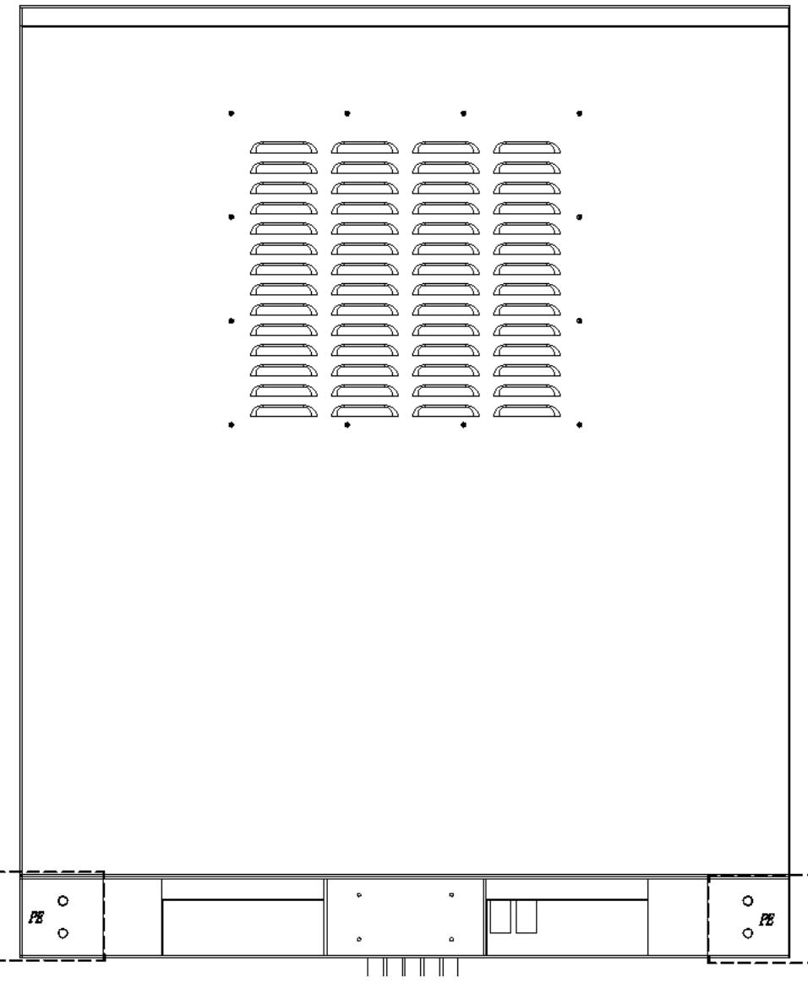  
图 4-4 汇流柜外接地扁钢

# 4.6 汇流柜对外接线

# 4.6.1 安全注意事项

# 告警

意外触碰带电端子会导致致命电击危险！

1) 确保储能变流器交直流开关处于断开状态，确保接线端子不带电。

2) 与电网进行连接时，必须经相关部门允许，同时遵守所有与电网相关的安全指令规范。

# 告警

汇流柜仅适用于 TN-S 的接地系统。

# 4.6.2 汇流柜至储能柜接线

# 4.6.2.1 汇流柜至储能柜接线总览

接线图如图4-5所示。

1)此铜排作用于连接储能柜;

2)A/B/C 相每根铜排预留 2 个 M8 接线孔，N 相预留 5 个 M8 接线孔；

3)每根铜排最多支持 3 路接线，多余两路需正反接，接线使用 70 方线缆与 SC70-8 端子；  
4)QF1 连接 1\~3#储能柜，QF2 连接 4\~6#储能柜，QF3 连接 7\~9#储能柜，

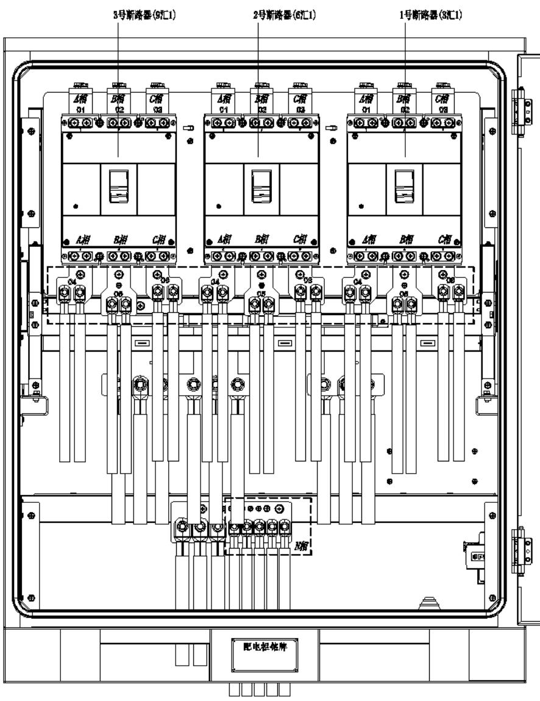  
图 4-5 接线总览

# 科陆

# 4.6.2.2 汇流柜至储能柜接线步骤

步骤1 确认前后级设备的断路器均为断开状态。

步骤2 将电缆从底部进线孔穿进汇流柜内部，线缆推荐使用 70mm2及以上截面积线缆。

步骤 3 确保交流电缆连接顺序正确。

步骤4 压接端子，参考“制作接线端子”。

步骤5 接线。

1 铜排接入参考上图 4-5(a)(b)。

2 将接线铜鼻压接在交流接线铜排上，参考“铜线接入”的连接顺序进行安装。

3 用螺丝刀或扳手紧固螺钉。紧固力矩请参见以下表格。

步骤6 确认接线牢固。

# 注意

接线螺钉长度应适当，稍稍露出铜排安装孔即可，太长可能会影响绝缘性能甚至短路。 检查接线铜鼻与铜排的连接处是否有部分热缩套管被夹，如果被夹应立即去除，否则可能导致接触不良，甚至发热损坏。

结束

# 4.6.3 汇流柜与电网接线

# 4.6.3.1 汇流柜至电网接线总览

接线图如图 4-6 所示。

1)此铜排作用于连接并网侧；

2)每根汇流排预留 3 个 M12 接线孔；

3)每根汇流最多支持6 路接线，需正反接，接线使用240 方线缆与SC240-12 端子；

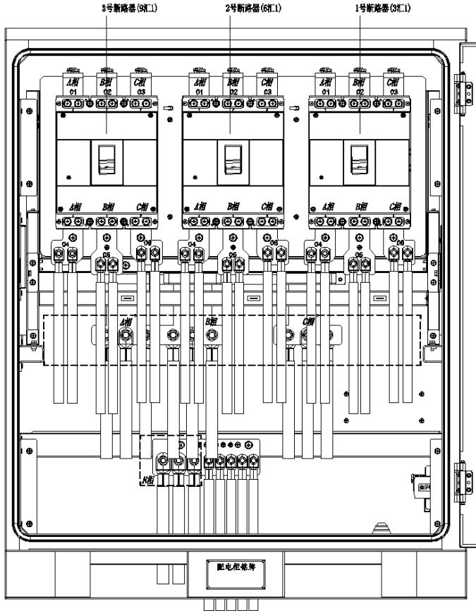  
图 4-6 汇流柜总览

# 4.6.3.2 接线步骤

步骤 1 断开前后级交流断路器并用万用表测量以确保端子无电压。

步骤 2 将电缆从底部进线孔穿进汇流柜内部，线缆实际根据设计院线缆推荐。

步骤 3 确保交流电缆连接顺序正确。

步骤 4 压接端子，参考“制作接线端子”。

步骤 5 接线。

1 参考图 4-6(a)(b)。

2 将接线铜鼻压接在交流接线铜排上，参考“铜线接入”的连接顺序进行安装。

3 用螺丝刀或扳手紧固螺钉。紧固力矩请参见以下表格。

步骤 6 确认接线牢固。

# 注意

接线螺钉长度应适当，稍稍露出铜排安装孔即可，太长可能会影响绝缘性能甚至短路。 检查接线铜鼻与铜排的连接处是否有部分热缩套管被夹，如果被夹应立即去除，否则可能导致接触不良，甚至发热损坏。

—结束

# 5.1 上电投运

# 告警

1) 在经过专业人员确认且得到当地电力部门许可后，储能系统设备才能投入运行。

2) 如果汇流柜停机时间过长，在上电前需先对储能系统设备进行全面检测，在符合各项指标要求后，方可根据上电步骤进行上电。

# 5.1.1 上电前检查

上电前，请仔细核对以下项目，确保无误。

检查接线是否正确。检查内部的防护罩已安装牢固。紧急停机按钮处于松开状态。检查以确保无接地故障。  
使用万用表检测交、直流侧电压是否满足启动条件，且无过压危险。  
检查以确保没有工具或零件遗落在设备内部。检查所有进出风口无异物遮挡或堵塞。

# 5.1.2 上电步骤

各断路器的位置，请参考“2.4.3 操作开关位置总览”

步骤1 完成辅助电源及一次主回路接线，测量电压及频率满足系统要求，进行下一步操作；

步骤2 上汇流柜柜内主回路电源：操作主回路交流开关 QF1、QF2、QF3 合闸；(1拖9的情况适用；若储能柜数量为 1\~3，仅 QF1 合闸；4\~6 台，QF1、QF2 合闸)；

步骤3 随后合上储能柜的各断路器。

自此，系统上电完成，可以检查操作触摸屏，检查系统是否正常。

# 5.1.3 下电操作

各断路器的位置，请参考“2.4.3 操作开关位置总览”

步骤 1 断开汇流柜交流主回路：操作主回路交流开关 QF1\~QF3 断开；——结束  
自此，系统下电完成。

本章节供了以下信息：

$\bullet$ 维护和修理流程必须按照一定的规则实施，以确保配件的可用性$\bullet$ 当设备维修时，如何更换元器件$\bullet$ 我司不承担因个人不当意图或未正确遵循本文指示和警告信息进行拆卸，安装，维护等操作造成的人身伤害和财产损失的责任。$\bullet$ 安装和维护系统时必须遵循警告信息。

# 告警

1) 在安装系统之前阅读整个文档。违反安全操作规范或不遵循本文件中的操作指示或警告信息都可能导致电击、重伤或死亡，可能损坏系统，导致其无法操作。

2) 汇流柜有一定重量。移动或升降建议使用专业设备。

3) 请本文指示安装和维护系统。

4) 如果有设备有缺陷、出现裂纹、断裂或其他损坏，禁止操作。

5) 在行电气接线部分之前，确保断路器处于断开状态。

6) 不要将异物插入机柜的任何部分。

7) 不要将机柜或其部件暴露于直接火焰中。

8) 不要将机柜或其部件暴露于直接火焰中。

9) 不要在加热设备附近安装机柜。

10) 不要将机柜或其部件浸入水中或其他液体中。

# 注意

1) 不要使用本手册规定以外的配件或线缆组装系统。

2) 确保电池组上方或附近没有水源，包括消防喷头或水龙头、空调滴水等。

# 注意

在实施维护或者修理工作时首先测量电压。这个电压可以在交流断路器的铜排上测量。

# 科陆

# 6.1 维护前注意事项

对储能系统进行维护或检修等操作时，为确保操作人员的安全，在系统维护之前必须在系统停机并且不带电的情况下进行，并按以下步骤进行操作：

1、控制前后级功率设备停机。  
2、确保汇流柜不会被意外重新上电。  
3、断开汇流柜所有外部连接。  
4、断开汇流柜内部供电电源的连接及开关，手动关闭 UPS（如有）。  
5、检测系统内开关是否已断开。  
6、施行必要的接地连接。

# 6.2 维护项目及周期

由于环境温度、湿度、灰尘、振动以及长期使用等影响，汇流柜内部的器件会发生老化及磨损等，从而导致汇流柜潜在的故障发生。因此，有必要对汇流柜实施日常及定期维护，以保证其正常运转与使用寿命。一切有助于汇流柜处于良好工作状态的措施及方法，均属于维护工作的范畴。

维护的目的是保护汇流柜的特定环境。必须按照特定的周期移除尘土和污染物并且替换局部损坏的部件。  
常见的维护项目及周期见表 6-1 所示。

表 6-1 系统维护项目及周期  

<table><tr><td rowspan=1 colspan=1>序号</td><td rowspan=1 colspan=1>检查内容</td><td rowspan=1 colspan=1>周期</td></tr><tr><td rowspan=1 colspan=1>1</td><td rowspan=1 colspan=1>整机机柜及环境检查</td><td rowspan=1 colspan=1>每6个月</td></tr><tr><td rowspan=1 colspan=1>2</td><td rowspan=1 colspan=1>主回路及辅助回路开关检查</td><td rowspan=1 colspan=1>每12个月</td></tr><tr><td rowspan=1 colspan=1>3</td><td rowspan=1 colspan=1>系统清洁</td><td rowspan=1 colspan=1>每12个月</td></tr><tr><td rowspan=1 colspan=1>4</td><td rowspan=1 colspan=1>接地可靠性检查</td><td rowspan=1 colspan=1>每12个月</td></tr><tr><td rowspan=1 colspan=1>5</td><td rowspan=1 colspan=1>风机（如有）维护检查</td><td rowspan=1 colspan=1>每6个月</td></tr><tr><td rowspan=1 colspan=1>6</td><td rowspan=1 colspan=1>标签脱落</td><td rowspan=1 colspan=1>每发现标签脱落时</td></tr></table>

注意：维修次序的实际间隔应该依赖于电柜安装环境以及操作状况。

# 系统软件及运行状态检查

1、读取软件中的数据，检查各项设置参数。  
2、必要时进行软件升级。

# 整机机柜及环境检查

1、柜门胶条老化，柜门紧闭性。  
2、柜体外观油漆是否破损，外表面及螺丝是否生锈。  
3、柜体接地是否有效。  
4、防尘网的尘垢。

# 功率回路及回路主开关检查

# 科陆

1、紧固电网、电池连接电缆的螺栓。  
2、紧固地线（PE）及柜体其他地线。  
3、检查主回路的各类开关，包括断路器和熔断器等。

# 系统清洁

1、用毛刷将机柜内部的灰尘清洁并取出。清洁人员必须是符合相关安全规定的人员。必须使用真空吸尘器和刷子清洁设备，同时对难以直接触及的地方使用高压气体。

2、清洁防尘罩的灰尘。

3、汇流柜前后有百叶窗需要定期清洁。百叶窗位置如图 6-1 所示。

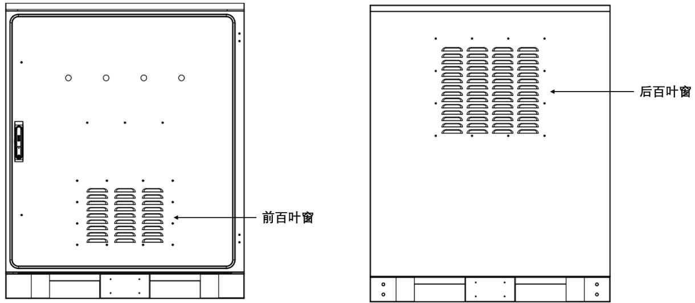  
图 6-1 百叶窗位置示意图

# 接地可靠性检查

1、检查系统内各个机柜外壳保护接地。  
2、检查系统防雷接地。

# 标签脱落

标签上的警示标识包含有对储能系统进行安全操作的重要信息，在每次进行系统维护时，当发现有标签脱落时，请及时粘贴新的标签。

# 6.3 故障排查

当储能系统不能按照预期输出或充放电量发生异常变化时，在咨询本公司维护人员之前，请注意检查如下事项：

汇流柜内所有开关状态；  
紧急停机旋钮是否处于按下状态；  
机柜和电网是否正确连接，并且通电；  
柜内的通讯是否正常。

# 科陆

# 6.4 故障排查

汇流柜常见故障及解决方法

表 6-2 汇流柜常见故障及解决方法  

<table><tr><td rowspan=1 colspan=1>序号</td><td rowspan=1 colspan=1>故障现象</td><td rowspan=1 colspan=1>故障排查</td></tr><tr><td rowspan=1 colspan=1>1</td><td rowspan=1 colspan=1>断路器无法分合闸</td><td rowspan=1 colspan=1>请联系Clou 更换开关。</td></tr><tr><td rowspan=1 colspan=1>2</td><td rowspan=1 colspan=1>防雷器动作，防雷指示为红色</td><td rowspan=1 colspan=1>请联系Clou 更换防雷器。</td></tr><tr><td rowspan=1 colspan=1>3</td><td rowspan=1 colspan=1>指示灯异常显示</td><td rowspan=1 colspan=1>请联系Clou更换指示灯。</td></tr><tr><td rowspan=1 colspan=1>4</td><td rowspan=1 colspan=1>熔丝断路</td><td rowspan=1 colspan=1>请联系Clou 更换熔丝。</td></tr></table>

# 7.1 质量保证

# 证据

本公司在质保期内，要求客户出示购买产品的发票和日期。同时产品上的商标应清晰可见，否则有权不予以质量保证。

# 条件

更换后的不合格的产品应由本公司处理• 客户应给本公司预留合理的时间去修理出现故障的设备

# 责任豁免

因以下情况出现，本公司有权不进行质量保证：

• 当任意分解产品或没有正确进行维护而产生的问题；  
• 整机、部件已经超出免费保修期；  
• 超出相关国际标准中规定的操作使用范围；  
• 没有按手册说明正确安装和操作而产生的问题；  
• 因非正常自然环境引起的产品损坏；  
• 因使用非标准部件或非本公司软件导致的机器损坏；  
• 因外部设备损坏致使产品损坏；  
• 因自行改造或维修本产品而造成的一切意外；  
• 因为客户原因导致的系统故障尚未排除而强行上电导致的安全事故、财产损失、设备损坏。

因以上原因引起的产品故障，客户要求进行维修服务时，经我司服务机构判定可提供有偿维修服务。需要维修或改造本产品时，请事先联系我司。

# 7.2 免责声明

深圳市科陆电子科技股份有限公司版权所有，保留一切权利。若设备使用人员未按手册标准规范操作，一切后果本司概不负责。

非经本司书面许可，任何单位和个人不得擅自摘抄、复制本文档内容的部分或全部，不得以任何形式传播。